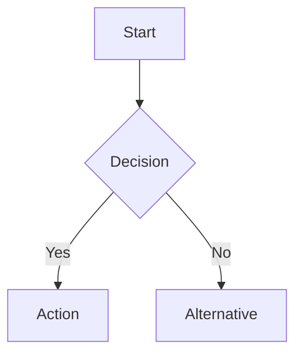

# Contributing to Records Manager Skill

Thank you for your interest in contributing to the Records Manager Skill! This document provides guidelines for contributing to both the skill code and the documentation.

---

## Table of Contents

- [Code Contributions](#code-contributions)
- [Documentation Contributions](#documentation-contributions)
- [Development Workflow](#development-workflow)
- [Testing](#testing)
- [Pull Request Process](#pull-request-process)

---

## Code Contributions

### Prerequisites

- **Node.js/Bun runtime** - The skill uses TypeScript
- **paperless-ngx instance** - For integration testing
- **PAI environment** - Skills are installed in `~/.claude/skills/`

### Setting Up Development Environment

1. **Clone the repository**

```bash
git clone https://github.com/madeinoz67/madeinoz-recordmanager-skill.git
cd madeinoz-recordmanager-skill
```

2. **Install dependencies**

```bash
bun install
```

3. **Configure environment**

```bash
cp .env.example .env
# Edit .env with your paperless-ngx credentials
```

4. **Run tests**

```bash
bun test
```

### Code Style

- **TypeScript** - All code must be valid TypeScript
- **Naming conventions**:
  - Classes: `PascalCase`
  - Functions/methods: `camelCase`
  - Constants: `UPPER_SNAKE_CASE`
- **Comments** - Document public APIs with JSDoc comments
- **Error handling** - Always handle errors gracefully with clear messages

### Making Changes

1. **Create a feature branch**

```bash
git checkout -b feature/your-feature-name
```

2. **Make your changes**

3. **Run tests**

```bash
bun test
```

4. **Commit your changes**

```bash
git add .
git commit -m "feat: add your feature description"
```

5. **Push and create a pull request**

```bash
git push origin feature/your-feature-name
```

---

## Documentation Contributions

The documentation is built with [MkDocs Material](https://squidfunk.github.io/mkdocs-material/) and automatically deployed to GitHub Pages.

### Prerequisites

- **Python 3.11+**
- **MkDocs Material** and dependencies

### Install Documentation Dependencies

```bash
pip install -r requirements-docs.txt
```

Or manually:

```bash
pip install mkdocs-material mkdocs-minify-plugin mkdocs-git-revision-date-localized-plugin
```

### Local Preview

1. **Start the local development server**

```bash
mkdocs serve
```

2. **Open your browser**

Navigate to: http://127.0.0.1:8000

3. **Edit documentation files**

All documentation files are in the `docs/` directory. Changes will automatically reload in your browser.

### Documentation Structure

```
docs/
├── index.md                     # Homepage
├── getting-started/             # Installation and quickstart
├── user-guide/                  # Daily usage workflows
├── configuration/               # Configuration guides
├── tutorials/                   # Step-by-step tutorials
├── reference/                   # API and CLI reference
├── extending/                   # Extension guides
├── examples/                    # Example prompts
└── architecture/                # System architecture
```

### Writing Documentation

#### Markdown Style

- **Headings** - Use ATX-style headings (`# Title`)
- **Links** - Use relative paths for internal links (`../reference/cli.md`)
- **Code blocks** - Specify language for syntax highlighting
- **Line length** - Keep lines under 100 characters for readability

#### Adding Mermaid Diagrams

Mermaid diagrams are supported for visualizations:

````markdown

````

Supported diagram types:
- **Flowcharts** - Process flows and decision trees
- **Sequence diagrams** - Actor interactions over time
- **State diagrams** - State transitions and lifecycles
- **ER diagrams** - Entity relationships

#### Navigation

To add a new page to the navigation:

1. **Create the markdown file** in the appropriate `docs/` subdirectory

2. **Add to `mkdocs.yml`** navigation:

```yaml
nav:
  - Section Name:
    - section/index.md
    - Your New Page: section/your-new-page.md
```

3. **Verify locally** - Run `mkdocs serve` and check the navigation

### Building Documentation

```bash
# Build the site
mkdocs build

# Output is in site/ directory
```

### Checking for Errors

```bash
# Strict mode (warnings become errors)
mkdocs build --strict

# Check specific issues
mkdocs build --strict 2>&1 | grep -E "WARNING|ERROR"
```

---

## Development Workflow

### Branch Naming

- **Features**: `feature/feature-name`
- **Bug fixes**: `fix/bug-description`
- **Documentation**: `docs/documentation-change`
- **Refactoring**: `refactor/refactor-description`

### Commit Messages

Follow [Conventional Commits](https://www.conventionalcommits.org/):

```
<type>: <description>

[optional body]

[optional footer]
```

**Types**:
- `feat` - New feature
- `fix` - Bug fix
- `docs` - Documentation changes
- `style` - Code style changes (formatting, etc.)
- `refactor` - Code refactoring
- `test` - Adding or updating tests
- `chore` - Maintenance tasks

**Examples**:

```bash
feat: add support for custom entity taxonomies
fix: resolve OCR timeout errors
docs: update installation guide for macOS
test: add integration tests for upload workflow
```

---

## Testing

### Running Tests

```bash
# Run all tests
bun test

# Run specific test file
bun test src/tests/RecordManager.test.ts

# Run with coverage
bun test --coverage
```

### Writing Tests

Tests are located in `src/tests/`:

```typescript
import { describe, it, expect } from 'bun:test';

describe('Your Feature', () => {
  it('should do something', () => {
    const result = yourFunction();
    expect(result).toBe(expectedValue);
  });
});
```

### Integration Testing

For integration tests that require paperless-ngx:

1. **Use test instance** - Never use production data
2. **Mock external services** - When possible
3. **Clean up** - Delete test documents after tests

---

## Pull Request Process

### Before Submitting

1. **Test your changes**
   ```bash
   bun test
   ```

2. **Build documentation** (if applicable)
   ```bash
   mkdocs build --strict
   ```

3. **Check code style**
   ```bash
   bun run lint
   ```

4. **Update documentation** - If adding features, update relevant docs

### PR Description Template

```markdown
## Description
Brief description of changes

## Type of Change
- [ ] Bug fix
- [ ] New feature
- [ ] Breaking change
- [ ] Documentation update

## Testing
- [ ] Tests added/updated
- [ ] All tests pass
- [ ] Manual testing completed

## Checklist
- [ ] Code follows project style guidelines
- [ ] Self-review completed
- [ ] Documentation updated
- [ ] No new warnings generated
```

### Review Process

1. **Automated checks** - CI/CD runs tests and builds
2. **Code review** - Maintainers review your code
3. **Feedback** - Address review comments
4. **Approval** - Once approved, your PR will be merged

---

## Getting Help

### Questions?

- **GitHub Issues** - For bug reports and feature requests
- **GitHub Discussions** - For questions and ideas
- **Documentation** - Check the docs first!

### Reporting Bugs

When reporting bugs, include:

- **Environment** - OS, Python/Node version, paperless-ngx version
- **Steps to reproduce** - Minimal reproduction case
- **Expected behavior** - What should happen
- **Actual behavior** - What actually happens
- **Error messages** - Full error output

---

## Code of Conduct

Be respectful, inclusive, and constructive. We're all here to build something great together.

---

## License

By contributing, you agree that your contributions will be licensed under the [MIT License](LICENSE).

---

**Thank you for contributing! 🎉**
