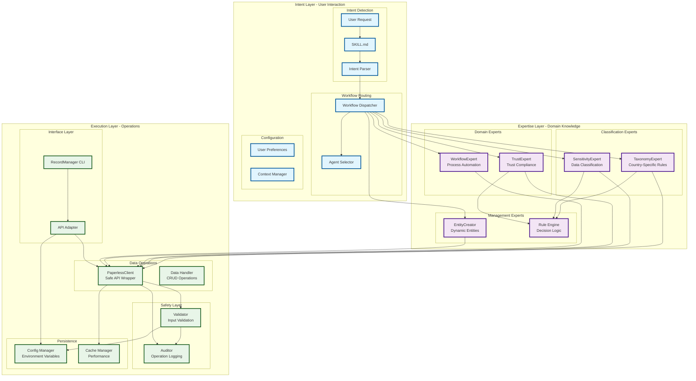

# Three-Layer Architecture

## Overview

The Records Manager Skill implements a three-layer architecture that provides clear separation of concerns, ensuring safety, maintainability, and extensibility. Each layer has distinct responsibilities and well-defined interfaces between them.

## Layer Architecture Diagram

## Intent Layer

### Purpose
The Intent Layer is responsible for understanding user requests and determining the appropriate expertise required to fulfill them. It acts as the primary interface between users and the system.

### Components

#### Intent Detection
- **User Input**: Accepts and processes user requests via command line interface
- **SKILL.md**: Defines workflows and intent patterns for record keeping operations
- **Intent Parser**: Analyzes user input to extract intent and parameters

#### Workflow Routing
- **Workflow Dispatcher**: Routes requests to appropriate workflows based on intent
- **Agent Selector**: Chooses the right agent for the specific operation type

#### Configuration Management
- **User Preferences**: Manages user-specific settings and preferences
- **Context Manager**: Maintains context across multiple operations

### Key Responsibilities
- Parse and understand user requests
- Route to appropriate domain experts
- Maintain user context and preferences
- Provide feedback and error messages
- Ensure safe operation boundaries

### Interface to Expertise Layer
The Intent Layer communicates with the Expertise Layer through well-defined interfaces:
- Request classification parameters
- Domain-specific context
- User preferences and constraints
- Operation type and parameters

## Expertise Layer

### Purpose
The Expertise Layer contains domain-specific knowledge and logic that provides intelligent processing of documents and compliance requirements. It ensures the system has deep understanding of record keeping domains.

### Components

#### Classification Experts
- **TaxonomyExpert**: Implements country-specific document taxonomies and retention rules
- **SensitivityExpert**: Classifies document sensitivity and applies appropriate handling

#### Domain Experts
- **TrustExpert**: Manages trust-specific compliance, ATO requirements, and document relationships
- **WorkflowExpert**: Recommends and automates workflows based on document patterns

#### Management Experts
- **EntityCreator**: Creates and manages dynamic entities (households, trusts, projects)
- **Rule Engine**: Applies business rules and decision logic

### Key Responsibilities
- Apply domain-specific knowledge to document processing
- Ensure compliance with legal and regulatory requirements
- Provide intelligent classification and tagging
- Recommend appropriate workflows
- Manage entity-specific rules and configurations

### Inter-Layer Communication
- **Receives**: Intent parameters, user context, document metadata
- **Processes**: Applies domain expertise, makes classifications, determines actions
- **Returns**: Processed documents, recommendations, compliance status

### Interface to Execution Layer
The Expertise Layer provides structured requirements to the Execution Layer:
- Document processing instructions
- Classification and tagging requirements
- API operation specifications
- Safety and validation rules

## Execution Layer

### Purpose
The Execution Layer handles the actual operations and interactions with external systems. It ensures all operations are performed safely and efficiently while maintaining audit trails.

### Components

#### Interface Layer
- **RecordManager CLI**: Command-line interface for all user operations
- **API Adapter**: Converts high-level requests to API calls

#### Data Operations
- **PaperlessClient**: Safe API wrapper for paperless-ngx (intentionally no delete methods)
- **Data Handler**: Manages CRUD operations and data transformations

#### Safety Layer
- **Validator**: Validates all inputs and operations before execution
- **Auditor**: Logs all operations for audit and compliance tracking

#### Persistence Layer
- **Config Manager**: Manages environment variable configuration
- **Cache Manager**: Optimizes performance through caching

### Key Responsibilities
- Execute document operations safely
- Maintain audit trails for all operations
- Validate inputs and prevent unsafe operations
- Manage configuration and environment
- Provide performance optimization

### Safety Design Features
- **No Delete Operations**: PaperlessClient intentionally omits delete methods
- **Mandatory Validation**: All operations pass through validation layer
- **Comprehensive Auditing**: Complete operation logging
- **Configuration Validation**: Safe handling of environment variables

## Inter-Layer Communication

### Intent → Expertise
- Direction: Intent Layer → Expertise Layer
- Data: User requests, intent parameters, context
- Flow: Request classification → Expertise selection → Requirements generation

### Expertise → Execution
- Direction: Expertise Layer → Execution Layer
- Data: Processing requirements, API specifications, safety rules
- Flow: Expertise application → Operation generation → Safe execution

### Execution → Intent (Feedback)
- Direction: Execution Layer → Intent Layer
- Data: Operation results, status updates, errors
- Flow: Execution completion → Status reporting → User feedback

## Benefits of Three-Layer Architecture

### 1. Separation of Concerns
- Clear boundaries between different types of responsibilities
- Easier to understand, maintain, and test individual components
- Reduced coupling between different aspects of the system

### 2. Safety and Security
- Multiple validation layers prevent unsafe operations
- Audit trails provide complete operation tracking
- Separation prevents accidental data loss

### 3. Extensibility
- New expertise can be added without affecting other layers
- Easy to swap out or extend individual components
- Clear interfaces allow for multiple implementations

### 4. Maintainability
- Components can be tested and modified independently
- Changes are localized to specific layers
- Clear documentation of responsibilities and interfaces

### 5. Compliance
- Domain experts ensure compliance requirements are met
- Auditing provides evidence of compliance
- Configuration management supports regulatory requirements

## Example Flow

### Document Upload Process
1. **Intent Layer**: User uploads document → SKILL.md detects upload intent
2. **Expertise Layer**: TaxonomyExpert classifies → TrustExpert checks compliance → SensitivityExpert assesses
3. **Execution Layer**: PaperlessClient uploads → Validator checks → Auditor logs

### Document Search Process
1. **Intent Layer**: User searches → SKILL.md parses query → Identifies search type
2. **Expertise Layer**: TaxonomyExpert refines query → Recommends search strategies
3. **Execution Layer**: PaperlessClient searches → Returns results → Formats for display

This three-layer architecture ensures the Records Manager Skill remains safe, extensible, and maintainable while providing powerful document management capabilities.