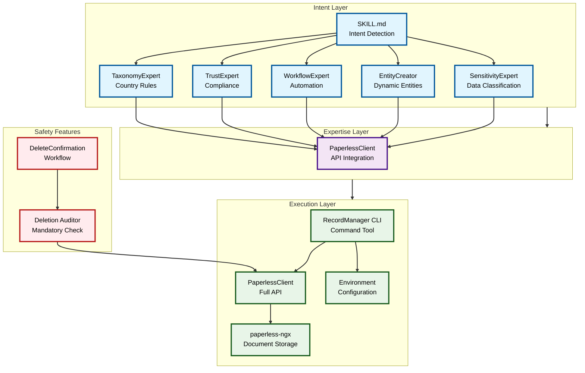

# System Architecture

## Overview

The Records Manager Skill follows a three-layer architecture that ensures clear separation of concerns, safety, and extensibility. This diagram shows the high-level system architecture and how components interact within and between layers.

## System Architecture Diagram

## Key Components

### Intent Layer (`SKILL.md`)
- **Primary Function**: Detects user intent and routes to appropriate expertise
- **Components**:
  - TaxonomyExpert for document classification
  - TrustExpert for trust-specific compliance
  - WorkflowExpert for automation recommendations
  - EntityCreator for dynamic entity management
  - SensitivityExpert for data classification

### Expertise Layer
- **Primary Function**: Provides domain-specific knowledge and processing
- **Components**:
  - **TaxonomyExpert**: Country-specific retention rules and classification
  - **TrustExpert**: Trust document management and ATO compliance
  - **WorkflowExpert**: Automated workflow recommendations
  - **EntityCreator**: Dynamic entity creation and management
  - **SensitivityExpert**: Document sensitivity classification

### Execution Layer
- **Primary Function**: Executes operations and manages API interactions
- **Components**:
  - **RecordManager CLI**: Main command-line interface
  - **PaperlessClient**: Full paperless-ngx API wrapper (safe - no delete methods)
  - **Environment Variables**: Configuration management

### Safety Features
- **Primary Function**: Ensures safe operation and prevents data loss
- **Components**:
  - **DeleteConfirmation Workflow**: Mandatory approval for all deletions
  - **Deletion Auditor**: Safety checkpoint before any destructive operations

### External Systems
- **paperless-ngx**: Document management system backend
- **Environment Variables**: Configuration with `MADEINOZ_RECORDMANAGER_` prefix

## Data Flow

1. **Intent Detection**: User request → SKILL.md analyzes and determines required expertise
2. **Expertise Application**: Appropriate experts process the request with domain knowledge
3. **Execution**: RecordManager CLI calls PaperlessClient for API operations
4. **Safety Check**: All deletions flow through DeleteConfirmation workflow
5. **External Integration**: PaperlessClient interfaces with paperless-ngx

## Safety Design

The architecture includes multiple safety layers:
- **No Delete Methods**: PaperlessClient intentionally omits delete operations
- **Mandatory Workflows**: All deletions require explicit user confirmation
- **Audit Trail**: Complete tracking of all operations
- **Configuration Validation**: Environment variable validation before operations

## Extensibility Points

The modular design allows for easy extension:
- **New Expert Types**: Add new expertise components without affecting existing layers
- **Custom Workflows**: Extend workflow system with new automation patterns
- **Entity Types**: Support additional entity types beyond household/corporate/trust
- **External Integrations**: Interface with other document management systems

## Configuration

All configuration uses environment variables with `MADEINOZ_RECORDMANAGER_` prefix:
- `MADEINOZ_RECORDMANAGER_PAPERLESS_URL` - paperless-ngx instance URL
- `MADEINOZ_RECORDMANAGER_PAPERLESS_API_TOKEN` - API token
- `MADEINOZ_RECORDMANAGER_RECORDS_COUNTRY` - Country for compliance rules
- `MADEINOZ_RECORDMANAGER_RECORDS_DEFAULT_DOMAIN` - Default domain

This architecture ensures the system remains safe, extensible, and maintainable while providing powerful document management capabilities.