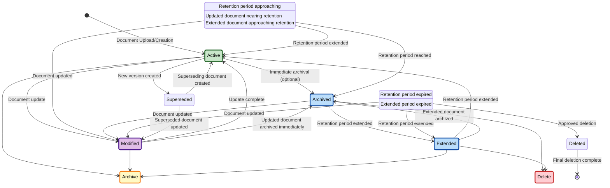

# Retention Lifecycle

## Overview

Document lifecycle management is a critical aspect of records management. The Records Manager Skill implements a comprehensive state-based lifecycle that ensures documents are properly managed according to retention policies, compliance requirements, and business needs.

## Retention Lifecycle State Diagram

## State Descriptions

### Active State
- **Description**: Document is currently in active use and regularly referenced
- **Characteristics**:
  - Full searchability and accessibility
  - Regular access patterns
  - Current retention period applies
  - Subject to normal workflows

**Transitions From**:
- Initial creation/upload
- Document update (Modified → Active)
- Retention extension (Extended → Active)

**Transitions To**:
- **Archive Ready**: When retention period is approaching
- **Archived**: For immediate archival (optional)
- **Modified**: When document is updated
- **Superseded**: When a new version is created

### Archive Ready State
- **Description**: Document is approaching its retention expiration date
- **Characteristics**:
  - May have restricted access
  - Automatic notifications sent
  - Ready for archival process
  - Final review opportunity

**Transitions From**:
- Active state (retention approaching)
- Archived state (retention extended)

**Transitions To**:
- **Archived**: When retention period is reached
- **Active**: If retention period is extended
- **Modified**: If document is updated

### Archived State
- **Description**: Document has been archived but not yet eligible for deletion
- **Characteristics**:
  - Reduced accessibility (searchable but may require special access)
  - Long-term storage
  - Compliance maintained
  - Audit trail preserved

**Transitions From**:
- Active (immediate archival)
- Archive Ready (retention reached)
- Modified (updated document archived)

**Transitions To**:
- **Delete Eligible**: When retention period expires
- **Extended**: If retention period is extended
- **Modified**: If document is updated

### Delete Eligible State
- **Description**: Document has reached the end of its retention period and is eligible for deletion
- **Characteristics**:
  - Subject to deletion review process
  - May be subject to legal hold
  - Requires explicit approval for deletion
  - Audit trail required

**Transitions From**:
- Archived (retention expired)

**Transitions To**:
- **Deleted**: When deletion is approved
- **Extended**: If retention period is extended
- **Modified**: If document is updated

### Modified State
- **Description**: Document is being updated or has been updated
- **Characteristics**:
  - Update in progress
  - May have version control
  - Retention period may be recalculated
  - Audit trail of changes

**Transitions From**:
- Active, Archive Ready, Archived, Delete Eligible (document updates)

**Transitions To**:
- **Active**: When update is complete
- **Archive Ready**: If updated document is nearing retention
- **Archived**: If updated document is archived immediately

### Superseded State
- **Description**: Document has been replaced by a newer version
- **Characteristics**:
  - Historic version
  - May be kept for reference
  - Subject to retention rules
  - Version relationship maintained

**Transitions From**:
- Active (new version created)

**Transitions To**:
- **Active**: When superseding document is created
- **Modified**: When superseded document is updated

### Extended State
- **Description**: Document retention period has been extended
- **Characteristics**:
  - New retention period applied
  - Compliance documentation required
  - Audit trail of extension
  - Business justification needed

**Transitions From**:
- Archived, Delete Eligible (retention extended)

**Transitions To**:
- **Active**: Extended period starts fresh
- **Archive Ready**: Document approaching new retention
- **Archived**: Extended document archived
- **Delete Eligible**: Extended period expired

### Deleted State
- **Description**: Document has been permanently deleted
- **Characteristics**:
  - No longer accessible
  - Deletion audit trail complete
  - Compliance requirements met
  - Final state

**Transitions From**:
- Delete Eligible (deletion approved)

**Transitions To**:
- [*] (end of lifecycle)

## Transition Triggers

### Automatic Triggers
- **Time-based**: Retention period expiration
- **System Events**: Document upload, modification, version creation
- **Workflow Events**: Automated archival processes

### Manual Triggers
- **User Actions**: Document updates, archival requests
- **Administrative Actions**: Retention period extensions, deletion approvals
- **Business Events**: New version creation, supersession

### Conditional Triggers
- **Compliance Events**: Legal holds, audit requirements
- **Business Rules**: Departmental policies, project completion
- **System Conditions**: Storage optimization, cleanup processes

## Retention Policies

### Country-Specific Rules
- **Australia**: ATO requirements, FTE document retention, Privacy Act compliance
- **United States**: IRS rules, state-specific requirements, federal regulations
- **United Kingdom**: HMRC guidelines, GDPR compliance, document retention schedules

### Entity-Specific Rules
- **Household**: Personal document retention, tax document rules
- **Corporate**: Business records, financial compliance, audit requirements
- **Trust**: Trust deed permanence, FTE documents, distribution records

### Document Type Rules
- **Financial**: Tax documents, invoices, bank statements (7-10 years)
- **Legal**: Contracts, agreements, court documents (10-25 years)
- **Personal**: Identification, certificates, personal records (varies)
- **Trust**: Trust deeds (permanent), FTE documents (5+ years from FTE)

## Compliance Features

### Audit Trail
- **State Transitions**: Complete logging of all state changes
- **Retention Tracking**: Documentation of retention periods and extensions
- **Deletion Records**: Comprehensive deletion process documentation
- **Access Logs**: Tracking of document access and modifications

### Legal Hold
- **Immediate Suspension**: Prevents deletion during legal proceedings
- **Status Tracking**: Visual indicators for documents under legal hold
- **Release Process**: Formal process for removing legal hold
- **Notification**: Alerts for legal hold status changes

### Compliance Reporting
- **Retention Reports**: Documents by retention status and expiration
- **Deletion Reports**: Records of all deletion actions and approvals
- **Audit Reports**: Complete lifecycle audit trails
- **Regulatory Reports**: Country and entity-specific compliance documentation

## Configuration

### Environment Variables
- `MADEINOZ_RECORDMANAGER_RECORDS_COUNTRY`: Country for retention rules
- `MADEINOZ_RECORDMANAGER_RECORDS_DEFAULT_DOMAIN`: Default entity domain
- `MADEINOZ_RECORDMANAGER_RETENTION_WARNINGS`: Warning period before expiration

### Customization Options
- **Override Retention**: Manual retention period setting
- **Extension Requests**: Business process for retention extensions
- **Delegation**: Authority levels for different actions
- **Notifications**: Configurable alerts and reminders

### Integration Points
- **paperless-ngx**: Document storage and retrieval
- **Workflow System**: Automated lifecycle management
- **Audit System**: Compliance tracking and reporting
- **Notification System**: Alerts and reminders

## Best Practices

### Lifecycle Management
1. **Early Classification**: Classify documents at upload for accurate retention
2. **Regular Review**: Periodic review of retention policies and documents
3. **Automation**: Use automated workflows for routine lifecycle transitions
4. **Documentation**: Maintain complete audit trails for all lifecycle changes

### Retention Period Management
1. **Standard Policies**: Implement standard retention policies by document type
2. **Business Justification**: Require justification for retention period extensions
3. **Legal Consultation**: Consult legal counsel for retention period decisions
4. **Regular Updates**: Review and update retention policies regularly

### Compliance Considerations
1. **Regulatory Requirements**: Stay current with applicable regulations
2. **Industry Standards**: Follow industry-specific record keeping standards
3. **Internal Policies**: Ensure alignment with internal policies and procedures
4. **International Operations**: Consider cross-border document requirements

The retention lifecycle ensures that documents are managed throughout their entire lifecycle, from creation through deletion, while maintaining compliance with legal, regulatory, and business requirements.