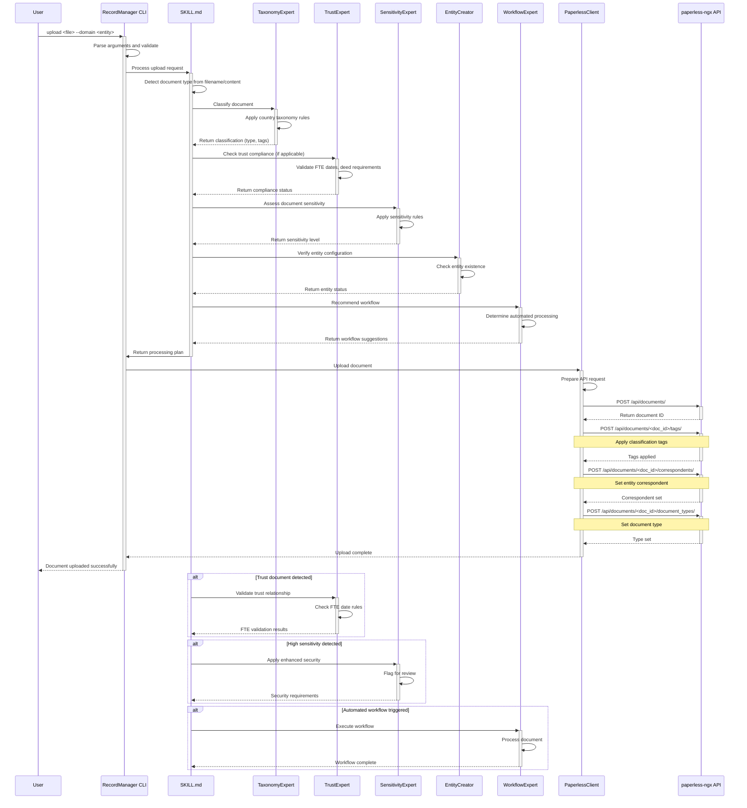

# Upload Workflow

## Overview

The document upload workflow demonstrates how the Records Manager Skill processes documents through the three-layer architecture. This sequence diagram shows the flow from user request to document storage in paperless-ngx.

## Upload Workflow Sequence Diagram



## Processing Steps

### 1. Initial Request Processing
- **User Command**: `upload document.pdf --domain household`
- **CLI Parsing**: Extract filename, entity type, and options
- **Validation**: Check file existence and entity validity

### 2. Intent Detection
- **SKILL.md**: Analyzes user request to determine intent
- **Document Classification**: Examines filename and content hints
- **Intent Confirmation**: Confirms this is an upload operation

### 3. Taxonomy Classification
- **TaxonomyExpert**: Applies country-specific classification rules
- **Document Type**: Determines primary document type (invoice, receipt, etc.)
- **Tags Generation**: Creates appropriate tags based on taxonomy
- **Retention Rules**: Sets initial retention period

### 4. Trust Compliance Check
- **TrustExpert**: Validates if document relates to trust entities
- **FTE Validation**: Checks Family Trust Election compliance
- **Deed Requirements**: Validates trust deed documents
- **Distribution Rules**: Applies trust-specific retention rules

### 5. Sensitivity Assessment
- **SensitivityExpert**: Evaluates document sensitivity
- **Data Classification**: Applies GDPR, Privacy Act, or local regulations
- **Security Requirements**: Determines handling restrictions
- **Access Control**: Sets appropriate access permissions

### 6. Entity Management
- **EntityCreator**: Verifies entity configuration
- **Correspondent Assignment**: Links document to entity
- **Domain Validation**: Ensures entity exists and is valid
- **Hierarchy Management**: Handles nested entity relationships

### 7. Workflow Recommendation
- **WorkflowExpert**: Suggests automated processing
- **OCR Processing**: Recommends OCR for scanned documents
- **Automation**: Identifies potential workflow triggers
- **Review Requirements**: Flags documents needing manual review

### 8. Document Upload
- **PaperlessClient**: Constructs API request
- **File Upload**: Sends document to paperless-ngx
- **Metadata Application**: Applies tags, types, correspondents
- **Response Handling**: Processes API response

### 9. Post-Processing
- **Confirmation**: Provides success message to user
- **Logging**: Records upload in audit trail
- **Notification**: Triggers follow-up workflows if needed
- **Cleanup**: Removes temporary files

## Key Interactions

### Classification Flow
```
User Request → SKILL.md → TaxonomyExpert → Classification Result
```

### Trust Compliance Flow
```
Trust Document → TrustExpert → FTE Validation → Compliance Status
```

### Sensitivity Flow
```
Document Content → SensitivityExpert → Security Level → Handling Rules
```

### Entity Management Flow
```
Entity Specification → EntityCreator → Verification → Assignment
```

## Error Handling

### Common Upload Errors
1. **Invalid Entity**: System validates entity exists before processing
2. **File Errors**: CLI validates file accessibility and format
3. **API Failures**: PaperlessClient handles paperless-ngx errors
4. **Classification Issues**: Fallback to manual classification

### Recovery Mechanisms
- **Retry Logic**: Automatic retry for transient failures
- **Rollback**: Partial uploads are cleaned up
- **Error Reporting**: Detailed error messages with suggestions
- **Logging**: Complete audit trail for troubleshooting

## Performance Considerations

### Optimization Techniques
- **Parallel Processing**: Multiple experts can work simultaneously
- **Caching**: Classification results cached for similar documents
- **Batch Operations**: Multiple tags applied in single API call
- **Stream Processing**: Large files streamed without loading entirely

### Scalability Features
- **Horizontal Scaling**: Multiple instances can handle uploads
- **Load Balancing**: Distributed processing across experts
- **Queue Management**: Backpressure handling during peak loads
- **Resource Management**: Memory-efficient processing

## Security Features

### Upload Security
- **File Validation**: Malware scanning and format checking
- **Permission Checks**: User authorization for entity access
- **Content Scanning**: Sensitive data detection
- **Audit Logging**: Complete operation tracking

### Data Protection
- **Encryption**: Optional encryption for sensitive documents
- **Access Control**: Role-based access management
- **Retention Policies**: Automated compliance enforcement
- **Privacy Protection**: GDPR and privacy act compliance

## Configuration Parameters

### Environment Variables
- `MADEINOZ_RECORDMANAGER_PAPERLESS_URL`: paperless-ngx instance URL
- `MADEINOZ_RECORDMANAGER_PAPERLESS_API_TOKEN`: API authentication token
- `MADEINOZ_RECORDMANAGER_RECORDS_COUNTRY`: Country for taxonomy rules
- `MADEINOZ_RECORDMANAGER_RECORDS_DEFAULT_DOMAIN`: Default entity domain

### Upload Options
- `--domain`: Entity for document assignment
- `--tags`: Additional tags to apply
- `--correspondent`: Override correspondent assignment
- `--type`: Override document type
- `--workflow`: Specific workflow to trigger

This upload workflow demonstrates how the three-layer architecture ensures safe, compliant, and efficient document processing while maintaining complete auditability and user control.