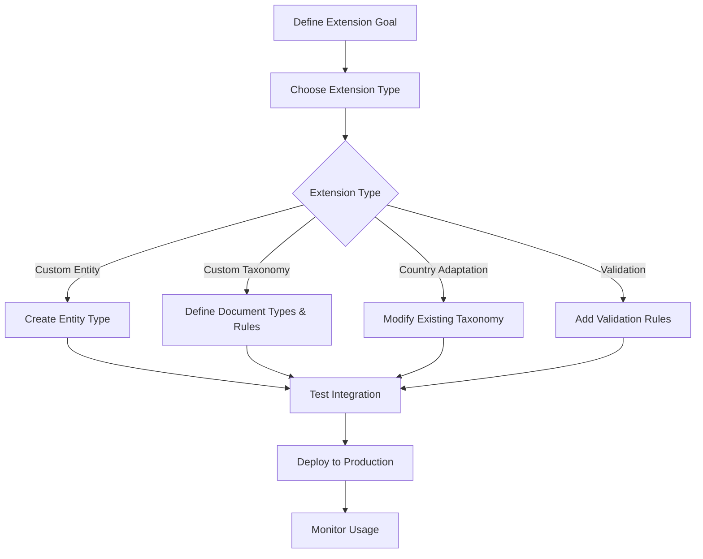

# Extending the Taxonomy System

The Records Manager Skill provides a flexible, extensible taxonomy system that allows you to customize document organization for your specific needs. This section guides you through extending the built-in system with custom entity types, taxonomies, and validation rules.

---

## Overview

The taxonomy system uses a hierarchical inheritance model that allows for extensive customization while maintaining consistency and compliance:

```
Base Taxonomy → Country Guidelines → Entity Types → Custom Extensions
```

### Key Concepts

* **Entity Types**: Define the scope of your document organization (household, corporate, projects, trusts)

* **Document Types**: Categorize specific kinds of documents within each entity

* **Tag Categories**: Organize tags into logical groups for easier management

* **Retention Rules**: Define how long documents should be kept based on legal and business requirements

* **Country Variations**: Adapt taxonomies to local jurisdictional requirements

---

## What You Can Extend

| Extension Type | Description | Difficulty |
|---|---|---|
| **Custom Entities** | Create new entity types beyond the built-in ones | ⭐⭐ |
| **Custom Taxonomies** | Define document types, tags, and retention rules for your domain | ⭐⭐⭐ |
| **Country Adaptations** | Modify existing taxonomies for your jurisdiction | ⭐⭐⭐⭐ |
| **Validation Rules** | Add custom validation for document metadata | ⭐⭐ |

---

## Getting Started

1. **Choose Your Extension Path**:

   * [Custom Entities](custom-entities.md) - For new organizational scopes

   * [Custom Taxonomies](custom-taxonomies.md) - For specialized document management

   * [Validation](validation.md) - For quality assurance and compliance

2. **Understand the Inheritance Model**:

   * Base definitions provide common patterns

   * Country guidelines add jurisdiction-specific rules

   * Entity types define organizational boundaries

   * Custom extensions personalize for your needs

3. **Test Your Extensions**:

   * Use the built-in validation commands

   * Test with sample documents

   * Verify retention calculations

---

## Built-in Entity Types

The system comes with six pre-configured entity types:

| Entity Type | Description | Supported Countries | Features |
|---|---|---|---|
| **Household** | Personal and family document management | AU, US, UK | Financial, medical, identity, pet records |
| **Corporate** | Business document management | AU | Accounting, HR, compliance, corporate governance |
| **Unit Trust** | Unit-based investment trust management | AU | Distributions, capital accounts, unit registry |
| **Discretionary Trust** | Flexible distribution trust management | AU | Beneficiary management, streaming resolutions |
| **Family Trust** | Family wealth management with FTE | AU | Family Trust Elections, 5-year retention rules |
| **Project** | Time-bound project documentation | AU | Project phases, deliverables, milestones |

---

## Extension Workflow



---

## Best Practices

### 1. Start with Existing Patterns

* Leverage the built-in entity types when possible

* Follow established naming conventions for tags and document types

* Use existing tag categories as a foundation

### 2. Maintain Compliance

* Document retention rules should align with legal requirements

* Consult with legal professionals for jurisdiction-specific rules

* Regularly review and update retention periods

### 3. Keep it Simple

* Avoid over-complicating tag structures

* Use consistent naming conventions

* Limit the number of document types to essential categories

### 4. Test Thoroughly

* Validate metadata suggestions with real documents

* Test retention calculations with various dates

* Verify search functionality with your new tags

---

## Next Steps

*   [Custom Entities](custom-entities.md) - Step-by-step guide for adding new entity types
*   [Custom Taxonomies](custom-taxonomies.md) - Configuration format and examples
*   [Validation](validation.md) - CLI validation and troubleshooting

---

## Need Help?

If you need assistance with extending the taxonomy system:

1. **Review the examples** in [Custom Taxonomies](custom-taxonomies.md)
2. **Check the validation tools** in [Validation](validation.md)
3. **Examine the source code** in the `src/lib/` directory
4. **Open an issue** on GitHub for specific questions

---

*Last Updated: 2026-01-20*