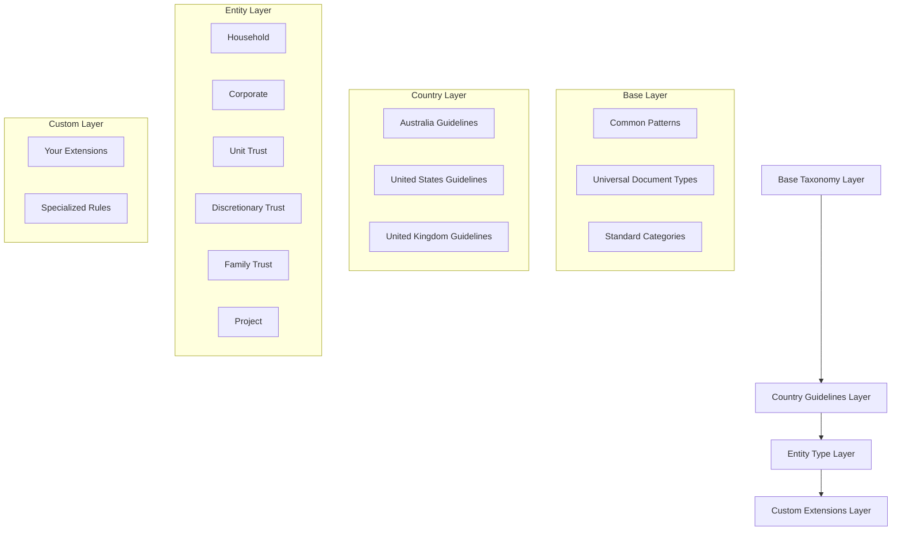
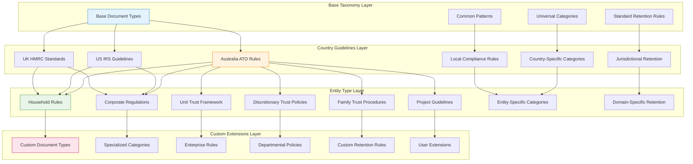

# Taxonomy System Overview

The Records Manager Skill uses a sophisticated taxonomy system that provides intelligent document organization, categorization, and retention management. This document explains how the system works and what built-in options are available.

---

## System Architecture

### Hierarchical Inheritance Model

The taxonomy system uses a four-layer inheritance model that ensures consistency while allowing flexibility:



### Data Structure

Each taxonomy consists of:

```typescript
interface DomainTaxonomy {
  documentTypes: string[];          // Available document categories
  tagCategories: {                  // Logical grouping of tags
    [category: string]: string[];   // Category → Array of tags
  };
  retentionRules: {                // How long to keep documents
    [documentType: string]: {
      years: number;               // Retention period in years
      reason: string;              // Legal/business reason
    };
  };
}
```

---

## Built-in Entity Types

### 1. Household
**Purpose**: Personal and family document management

**Supported Countries**: Australia, United States, United Kingdom

**Document Types**:
- Financial: Tax Returns, Bank Statements, Investment Statements
- Medical: Medical Records, Prescriptions, Test Results
- Insurance: Policies, Claims, Certificates
- Legal: Contracts, Wills, Powers of Attorney
- Identity: Birth Certificates, Passports, Driver Licenses
- Household: Utility Bills, Rate Notices, Pet Records

**Key Features**:
- Pet document tracking (vaccinations, microchips, adoption records)
- Australian tax compliance (ATO requirements)
- Identity document management
- Vehicle and lease documentation

**Retention Examples**:
- Tax Returns: 7 years (ATO Section 254)
- Medical Receipts: 7 years (tax substantiation)
- Birth Certificates: 15 years (permanent records)

### 2. Corporate
**Purpose**: Business document management

**Supported Countries**: Australia

**Document Types**:
- Financial: Invoices, Receipts, Financial Statements
- HR: Employee Records, Payroll, Contracts
- Compliance: Reports, Certificates, Licenses
- Corporate: Board Resolutions, Shareholder Records

**Key Features**:
- Fair Work Act compliance
- Corporations Act requirements
- GST and BAS documentation
- Corporate governance records

**Retention Examples**:
- Financial Statements: 7 years (Corporations Act)
- Board Resolutions: 15 years (permanent records)
- Payroll Records: 7 years (ATO requirement)

### 3. Unit Trust
**Purpose**: Unit-based investment trust management

**Supported Countries**: Australia

**Document Types**:
- Governance: Trust Deed, Trustee Appointments
- Financial: Annual Statements, Distributions
- Compliance: Tax Returns, GST Registration
- Registry: Unit Registry, Unit Transfers

**Key Features**:
- Capital Gains Tax tracking
- Unit registry management
- Distribution statements
- Actuarial certificates

**Retention Examples**:
- Trust Deed: 15 years (permanent)
- Unit Registry: 15 years (ownership records)
- Annual Statements: 7 years (tax substantiation)

### 4. Discretionary Trust
**Purpose**: Flexible distribution trust management

**Supported Countries**: Australia

**Document Types**:
- Governance: Trustee Resolutions, Minutes
- Distribution: Distribution Minutes, Beneficiary Declarations
- Compliance: Tax Returns, BAS Statements
- Legal: Trust Deed Variations, Appointor Documents

**Key Features**:
- Section 100A ITAA 1936 compliance
- Beneficiary management
- Streaming resolutions
- Discretionary distribution decisions

**Retention Examples**:
- Trustee Resolutions: 7 years (distribution substantiation)
- Distribution Minutes: 7 years (ATO evidence)
- Trust Deed: 15 years (permanent)

### 5. Family Trust
**Purpose**: Family wealth management with Family Trust Election (FTE)

**Supported Countries**: Australia

**Document Types**:
- Core: Trust Deed, Family Trust Election
- Governance: Trustee Resolutions, Minutes
- Distribution: Distribution Minutes, Income Statements
- Compliance: Tax Returns, Actuarial Certificates
- Special: Interpositionary/Loss Trust Elections

**Key Features**:
- **CRITICAL**: 5-year retention from FTE date (not EOFY)
- Section 272-80 ITAA 1936 compliance
- Family-specific governance
- FTE date tracking

**Retention Examples**:
- Family Trust Election: 5 years from FTE date
- Trustee Resolutions: 7 years (distribution substantiation)
- Trust Deed: 15 years (permanent)

### 6. Project
**Purpose**: Time-bound project documentation

**Supported Countries**: Australia

**Document Types**:
- Planning: Project Plans, Requirements
- Execution: Contracts, Invoices, Progress Reports
- Closure: Final Reports, Acceptance Documents
- Types: Software, Construction, Research, Creative

**Key Features**:
- Project lifecycle tracking
- Type-specific categorization
- Date-based project management
- Milestone documentation

**Retention Examples**:
- Project Plans: 7 years (planning documentation)
- Final Reports: 10 years (completion records)
- Contracts: 10 years (statute of limitations)

---

## Country Variations

### Australia
- **Primary Focus**: ATO compliance
- **Key Laws**: Tax Administration Act 1953, Corporations Act
- **Special Features**: Family Trust Elections, FTE date tracking
- **Retention Periods**: 5-15 years, with some permanent records

### United States
- **Primary Focus**: IRS compliance
- **Key Laws**: Internal Revenue Code
- **Special Features**: State-specific variations
- **Retention Periods**: 7-10 years for most documents

### United Kingdom
- **Primary Focus**: HMRC compliance
- **Key Laws**: Taxes Management Act
- **Special Features**: Self-assessment requirements
- **Retention Periods**: 7 years for tax documents

---

## Tag Categories

All entities use standardized tag categories:

### Universal Categories
- **Financial**: Tax, income, expense, investment
- **Legal**: Contracts, agreements, wills, powers of attorney
- **Medical**: Doctor, hospital, pharmacy, insurance
- **Insurance**: Home, vehicle, health, life
- **Compliance**: Audit, reports, certificates

### Entity-Specific Categories
- **Household**: Utility, maintenance, warranty, pet
- **Corporate**: HR, payroll, board, shareholder
- **Trust**: Governance, beneficiary, distribution, unit
- **Project**: Planning, execution, closure, milestone

### Special Categories
- **Identity**: Birth, passport, license, citizenship
- **Vehicle**: Registration, lease, insurance
- **Education**: Transcript, certificate, qualification

---

## Retention Rules

### Retention Period Types
- **Years**: Numeric value (e.g., 7 years)
- **Permanent**: Keep indefinitely (15+ years)
- **Until Expired**: Keep until document expires (0 years = until expiry)

### Special Handling
- **Family Trust Elections**: 5 years from FTE date, not EOFY
- **Trust Deeds**: Permanent records (15+ years)
- **Statute of Limitations**: Generally 10 years for contracts
- **Tax Requirements**: 7 years for most tax documents

### Legal References
- **Australia**: Section 254 Tax Administration Act 1953
- **Australia**: Section 272-80 ITAA 1936 (Family Trusts)
- **US**: IRS recommendation (3-7 years)
- **UK**: HMRC self-assessment (7 years)

---

## Metadata Suggestions

The system automatically suggests metadata based on:

1. **Filename Analysis**: Pattern matching against known document types
2. **Content Analysis**: OCR text extraction and keyword matching
3. **Entity Context**: Current domain and country settings
4. **Historical Patterns**: User behavior and common associations

### Suggestion Priority
1. Document Type (highest confidence)
2. Primary Category Tags
3. Secondary Descriptive Tags
4. Entity and Domain Tags
5. Custom Notes and Warnings

---

## Extending the System

To add new capabilities:

1. **Custom Entities**: Create new organizational scopes
2. **Custom Taxonomies**: Define specialized document types
3. **Country Adaptations**: Modify existing rules for new jurisdictions
4. **Validation Rules**: Add custom metadata validation

See the other sections in this documentation for detailed guides.

---

## Troubleshooting

### Common Issues
- **No taxonomy found**: Check country/entity type configuration
- **Incorrect retention**: Verify document type detection
- **Missing tags**: Check tag category definitions
- **Wrong suggestions**: Review filename and content analysis

### Validation Commands
```bash
# Check taxonomy configuration
bun run recordmanager validate --taxonomy

# Test metadata suggestions
bun run recordmanager test --suggest --file sample.pdf

# Verify retention calculations
bun run recordmanager test --retention --document-type "Tax Return"
```

---

## Taxonomy Inheritance

The taxonomy system implements a sophisticated inheritance model that ensures consistency while allowing extensive customization. This detailed flowchart shows how taxonomies are structured and extended across different layers.

### Taxonomy Inheritance Flowchart



### Inheritance Rules

#### Base Layer Inheritance
- **Universal Document Types**: Core document types recognized worldwide
- **Standard Categories**: Common classification schemes
- **Base Retention Rules**: Minimum retention requirements
- **Pattern Recognition**: Document classification patterns

#### Country Layer Override
- **Jurisdictional Rules**: Country-specific legal requirements
- **Local Categories**: Region-specific document classifications
- **Modified Retention**: Adjusted retention periods by jurisdiction
- **Compliance Extensions**: Additional compliance rules

#### Entity Layer Specialization
- **Domain Rules**: Entity-specific document handling
- **Specialized Categories**: Entity-focused classification schemes
- **Extended Retention**: Entity-specific retention modifications
- **Business Logic**: Entity workflow requirements

#### Custom Layer Extension
- **Complete Override**: Full customization capabilities
- **Selective Extension**: Add new types without replacing
- **Hybrid Inheritance**: Mix base and custom rules
- **Dynamic Configuration**: Runtime configuration support

### Resolution Order

The system applies taxonomies in the following order:

1. **Custom Extensions Layer**: User-defined rules (highest priority)
2. **Entity Type Layer**: Domain-specific rules
3. **Country Guidelines Layer**: Jurisdictional requirements
4. **Base Taxonomy Layer**: Universal defaults (lowest priority)

### Conflict Resolution

When multiple taxonomies define the same document type:

1. **Custom Extensions**: Always take precedence
2. **Entity Rules**: Override country rules for specific entities
3. **Country Rules**: Override base rules for jurisdiction
4. **Base Rules**: Used as fallback when no specific rules exist

### Extension Points

#### Custom Entities
Add new organizational scopes:
```typescript
interface CustomEntity {
  name: string;
  documentTypes: string[];
  categories: string[][];
  retentionRules: RetentionRule[];
}
```

#### Custom Taxonomies
Define specialized classifications:
```typescript
interface CustomTaxonomy {
  documentType: string;
  categories: string[];
  tags: string[];
  retention: RetentionPeriod;
  metadata?: MetadataRule[];
}
```

#### Country Adaptations
Modify existing rules:
```typescript
interface CountryAdaptation {
  country: string;
  modifications: {
    documentTypes?: string[];
    retentionAdjustments?: Record<string, number>;
    additionalCategories?: string[][];
  };
}
```

### Inheritance Benefits

1. **Consistency**: Base rules ensure universal document handling
2. **Compliance**: Country rules meet legal requirements
3. **Specialization**: Entity rules address business needs
4. **Flexibility**: Custom rules allow enterprise adaptation
5. **Maintenance**: Updates propagate through inheritance chain

### Example: Tax Return Processing

1. **Base Layer**: Generic "Tax Return" type, 7-year retention
2. **Australia Layer**: ATO-specific rules, BAS requirements
3. **Household Entity**: Personal tax processing, individual deductions
4. **Custom Extension**: Additional categories for crypto tax reporting

This inheritance model provides a robust foundation for document management while allowing extensive customization to meet specific organizational needs.

---

*Last Updated: 2026-01-20*