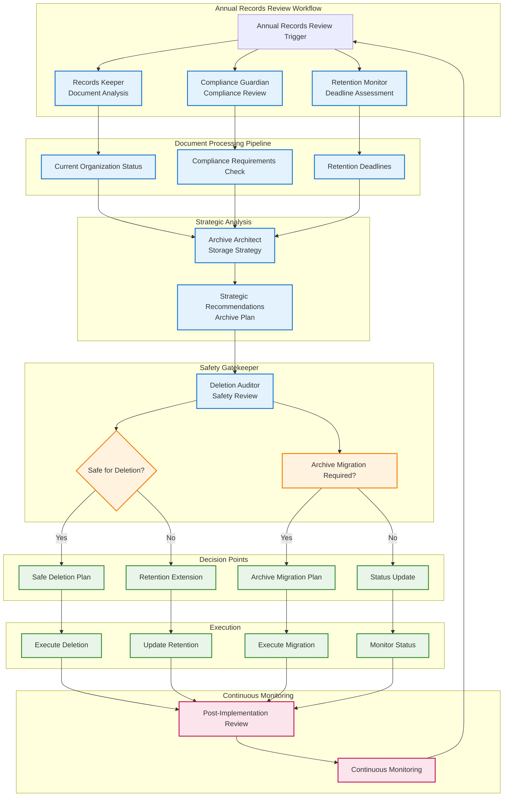
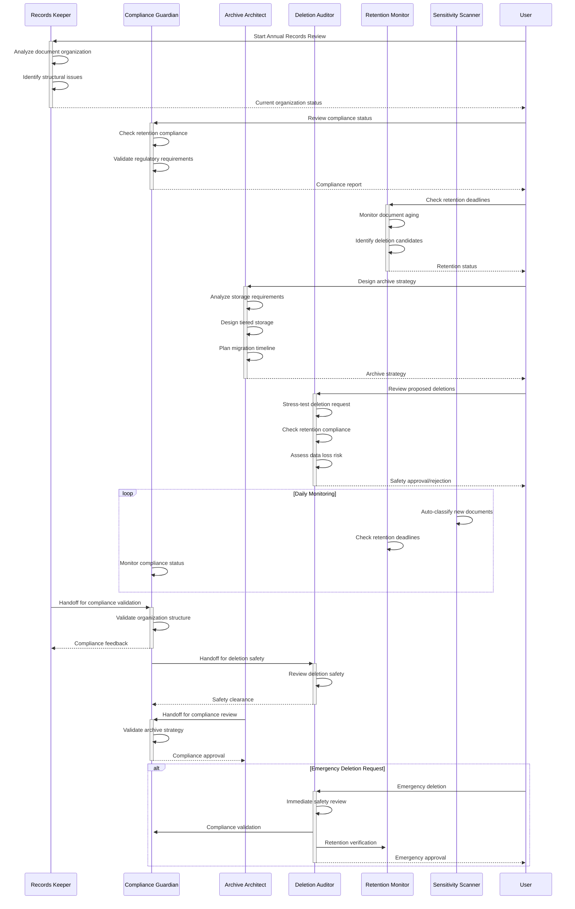

# Records Manager Agent Capabilities

> Comprehensive documentation for specialized record keeping agents with domain expertise, personality characteristics, and collaboration workflows

## Table of Contents

1. [Agent Roster](#agent-roster)
2. [Agent Details](#agent-details)
3. [Agent Collaboration](#agent-collaboration)
4. [Integration with Records Manager](#integration-with-records-manager)
5. [Safety Considerations](#safety-considerations)
6. [Example Scenarios](#example-scenarios)

---

## Agent Roster

| Agent | Icon | Domain | Personality | Voice | Specialization |
|-------|------|--------|-------------|-------|----------------|
| Records Keeper | 📋 | Research Specialist | Meticulous, Analytical, Systematic | Drew (Professional, balanced) | Document taxonomy and organization |
| Compliance Guardian | ⚖️ | Legal Analyst | Cautious, Meticulous, Thorough | Joseph (Formal, authoritative) | Retention requirements and compliance |
| Archive Architect | 🏛️ | Data Analyst + Research | Analytical, Pragmatic | Charlotte (Sophisticated, intellectual) | Storage strategy and lifecycle planning |
| Deletion Auditor | 🛡️ | Security Expert | Skeptical, Cautious | George (Warm, academic) | **Mandatory** deletion safety |
| Sensitivity Scanner | 🔒 | Security Expert | Cautious, Systematic | James (Security-focused) | Data classification and DLP |
| Retention Monitor | ⏰ | Business Strategist | Meticulous, Cautious | Joseph (Authoritative) | Time-based compliance monitoring |

---

## Agent Details

### 1. Records Keeper 📋

#### Domain Expertise and Knowledge Base
- **Primary Domain**: Research Specialist (Data Organization & Classification)
- **Knowledge Base**:
  - Document taxonomy design principles
  - Paperless-ngx tag hierarchies
  - Metadata optimization strategies
  - Search optimization techniques
  - Organizational structure best practices
  - Entity-specific classification (household, corporate, trusts)

#### Personality Characteristics and Approach
- **Personality Traits**: Meticulous, Analytical, Systematic
- **Approach Methodology**: Thorough, systematic analysis with attention to detail
- **Communication Style**: Professional, balanced, and neutral
- **Problem-Solving Style**: Data-driven with structured methodology

#### Voice Identity
- **Voice**: Drew (Professional, balanced, neutral)
- **Voice ID**: 29vD33N1CtxCmqQRPOHJ
- **Characteristics**: Clear, articulate, and consistently professional tone

#### Trigger Phrases and Use Cases
**Primary Triggers:**
- "organize my documents"
- "optimize my tagging system"
- "analyze document structure"
- "improve document findability"
- "create taxonomy"

**Use Cases:**
- Analyzing document collections and suggesting taxonomies
- Organizing unstructured document repositories
- Designing tag hierarchies for households/corporations
- Improving document search and retrieval
- Quarterly document completeness verification (Entity Health Check)

#### Integration with Other Agents
- **Handoff to Compliance Guardian**: After organization, validates compliance
- **Handoff to Archive Architect**: Provides organized data for strategic planning
- **Input from Sensitivity Scanner**: Works with classified documents
- **Collaboration with Retention Monitor**: Ensures organized documents meet retention requirements

#### Example Scenarios
**Scenario 1: Document Upload Organization**
```
User: "Upload these tax documents and organize them properly"
→ Records Keeper analyzes filenames and content
→ Uses TaxonomyExpert to suggest tags
→ Calls RecordManager upload with intelligent metadata
→ Provides summary of organization applied
```

**Scenario 2: Taxonomy Optimization**
```
User: "Improve my document tagging system"
→ Analyzes current tag usage and document types
→ Identifies gaps and redundancies
→ Suggests optimized tag hierarchy
→ Recommends metadata improvements
```

---

### 2. Compliance Guardian ⚖️

#### Domain Expertise and Knowledge Base
- **Primary Domain**: Legal Analyst (Retention & Regulatory Requirements)
- **Knowledge Base**:
  - Country-specific retention requirements (Australia, US, UK)
  - ATO compliance standards and regulations
  - Trust deed retention requirements (permanent)
  - Family Trust Election (FTE) 5+ year retention rules
  - Audit trail verification procedures
  - Risk assessment methodologies

#### Personality Characteristics and Approach
- **Personality Traits**: Cautious, Meticulous, Thorough
- **Approach Methodology**: Thorough, exhaustive analysis with legal precision
- **Communication Style**: Formal, authoritative, and precise
- **Problem-Solving Style**: Risk-averse with compliance-first mindset

#### Voice Identity
- **Voice**: Joseph (Formal, authoritative, British)
- **Voice ID**: Zlb1dXrM653N07WRdFW3
- **Characteristics**: Confident, authoritative, and legally precise tone

#### Trigger Phrases and Use Cases
**Primary Triggers:**
- "check compliance"
- "retention requirements"
- "legal review"
- "ato compliance"
- "trust deed requirements"

**Use Cases:**
- Reviewing proposed deletions for legal risks
- Checking if documents can be safely destroyed
- Ensuring retention requirements are met
- Identifying compliance gaps in document storage
- Generating ATO compliance reports
- Warning about retention period violations

#### Integration with Other Agents
- **Handoff to Deletion Auditor**: Provides retention validation for deletion review
- **Input from Retention Monitor**: Uses retention deadline information
- **Collaboration with Records Keeper**: Validates organizational compliance
- **Support for Sensitivity Scanner**: Ensures classified documents meet regulatory standards

#### Example Scenarios
**Scenario 1: Retention Validation**
```
User: "Can I delete these old tax documents?"
→ Compliance Guardian checks:
  • Document type and retention period
  • Country-specific requirements
  • ATO compliance standards
  • Trust deed implications (if applicable)
→ Provides clearance or warnings
```

**Scenario 2: ATO Compliance Report**
```
User: "Generate quarterly ATO compliance report"
→ Compiles document retention status
• Verifies retention periods are being followed
• Generates audit trail documentation
• Maps compliance to regulatory requirements
```

---

### 3. Archive Architect 🏛️

#### Domain Expertise and Knowledge Base
- **Primary Domain**: Data Analyst + Research Specialist (Storage & Retrieval Strategy)
- **Knowledge Base**:
  - Long-term document storage architecture
  - Search optimization and retrieval patterns
  - Archive structures and hierarchies
  - Data migration and archival strategies
  - Systems thinking for document lifecycles
  - Tiered storage optimization

#### Personality Characteristics and Approach
- **Personality Traits**: Analytical, Pragmatic
- **Approach Methodology**: Synthesizing, thorough with strategic thinking
- **Communication Style**: Sophisticated, intellectual, and precise
- **Problem-Solving Style**: Strategic with long-term perspective

#### Voice Identity
- **Voice**: Charlotte (Sophisticated, intellectual, precise)
- **Voice ID**: XB0fDUnXU5powFXDhCwa
- **Characteristics**: Intelligent, precise, and systematically clear tone

#### Trigger Phrases and Use Cases
**Primary Triggers:**
- "archive strategy"
- "storage optimization"
- "lifecycle planning"
- "document migration"
- "long-term storage"

**Use Cases:**
- Designing archival systems for large document collections
- Optimizing document findability across decades
- Planning archive-to-cold-storage migrations
- Creating retention policies and archive procedures
- Strategic document lifecycle planning
- Workflow effectiveness analysis

#### Integration with Other Agents
- **Handoff to Compliance Guardian**: Archive plans reviewed for compliance
- **Input from Records Keeper**: Uses organized document structures
- **Collaboration with Retention Monitor**: Aligns archive strategy with retention periods
- **Input from Sensitivity Scanner**: Considers sensitivity levels in archive design

#### Example Scenarios
**Scenario 1: Archive Design**
```
User: "Design an archive strategy for my corporate records"
→ Analyzes document collection structure
→ Designs tiered storage strategy
→ Optimizes for search and retrieval
→ Provides migration plan with timelines
```

**Scenario 2: Workflow Optimization**
```
User: "Improve document processing workflows"
→ Analyzes current workflow patterns
→ Identifies bottlenecks and inefficiencies
→ Recommends workflow enhancements
→ Suggests A/B testing approaches
```

---

### 4. Deletion Auditor 🛡️

#### Domain Expertise and Knowledge Base
- **Primary Domain**: Security Expert + Communications (Risk Assessment & Safety)
- **Knowledge Base**:
  - Catastrophic loss prevention strategies
  - Risk assessment methodologies
  - Audit trail maintenance procedures
  - Adversarial review techniques
  - Retention period verification
  - Legal compliance validation

#### Personality Characteristics and Approach
- **Personality Traits**: Skeptical, Cautious
- **Approach Methodology**: Adversarial, exhaustive with stress-testing approach
- **Communication Style**: Warm, academic, and intellectually challenging
- **Problem-Solving Style**: Risk-focused with "what could go wrong" mentality

#### Voice Identity
- **Voice**: George (Warm, academic, intellectual)
- **Voice ID**: JBFqnCBsd6RMkjVDRZzb
- **Characteristics**: Thoughtful, academic, and safety-conscious tone

#### Trigger Phrases and Use Cases
**Primary Triggers:**
- "delete documents" (MANDATORY for all deletion requests)
- "remove files"
- "destroy records"
- "clear out old documents"

**Use Cases**:
- **MANDATORY**: Reviewing all deletion requests before execution
- Identifying risks in proposed bulk deletions
- Ensuring deletion confirmation workflow is followed
- Checking retention periods before allowing deletion
- Audit logging for compliance and legal protection

**CRITICAL SAFETY ROLE**: This agent MUST be consulted before ANY document deletion. The DeleteConfirmation workflow should route through this agent.

#### Integration with Other Agents
- **Mandatory Gatekeeper**: All deletion requests route through this agent
- **Input from Compliance Guardian**: Uses retention period validation
- **Input from Records Keeper**: Understands document importance and relationships
- **Input from Retention Monitor**: Confirms documents are past retention periods

#### Example Scenarios
**Scenario 1: Deletion Safety Review**
```
User: "Delete all insurance documents from before 2020"
→ Deletion Auditor conducts adversarial review:
  • Checks retention requirements
  • Identifies potential data loss risks
  • Shows exactly what will be deleted
  • Warns about consequences
  • Requires explicit confirmation phrase
  • Only after approval: proceeds with deletion
```

**Scenario 2: Bulk Deletion Risk Assessment**
```
User: "Remove all project files from 2018"
→ Auditor stress-tests the request:
  • Analyzes potential business impact
  • Checks for regulatory implications
  • Identifies dependent documents
  • Questions deletion criteria
  • Requires specific approval wording
```

---

### 5. Sensitivity Scanner 🔒

#### Domain Expertise and Knowledge Base
- **Primary Domain**: Security Expert (Data Loss Prevention & Classification)
- **Knowledge Base**:
  - Four-tier sensitivity classification (Public, Internal, Confidential, Restricted)
  - HIPAA PHI detection patterns
  - PCI-DSS cardholder data detection
  - GDPR PII detection and flagging
  - Legal privilege detection
  - Security control requirements

#### Personality Characteristics and Approach
- **Personality Traits**: Cautious, Systematic
- **Approach Methodology**: Systematic, thorough with pattern-based analysis
- **Communication Style**: Security-focused and precise
- **Problem-Solving Style**: Risk-averse with compliance-driven approach

#### Voice Identity
- **Voice**: James (Security-focused)
- **Voice ID**: ZQe5CZNOzWyzPSCn5a3c
- **Characteristics**: Security-conscious and systematically alert tone

#### Trigger Phrases and Use Cases
**Primary Triggers:**
- "scan for sensitivity"
- "classify documents"
- "check for PII"
- "PHI detection"
- "security classification"

**Use Cases:**
- Auto-classifying new uploads by sensitivity
- Scanning existing documents for sensitivity violations
- Detecting regulated data (PHI, PCI, PII)
- Applying appropriate sensitivity tags and colors
- DLP compliance monitoring
- Security risk assessment

**Automatic Triggers:**
- New document uploads
- Daily scans of untagged documents
- Manual security reviews

#### Integration with Other Agents
- **Input to All Agents**: Provides sensitivity classifications for context
- **Handoff to Compliance Guardian**: High-sensitivity documents reviewed for compliance
- **Input to Deletion Auditor**: Sensitivity levels affect deletion risk assessment
- **Collaboration with Archive Architect**: Sensitive documents influence storage strategy

#### Example Scenarios
**Scenario 1: Auto-Classification**
```
User uploads medical document
→ Sensitivity Scanner analyzes content:
  • Detects PHI patterns
  • Classifies as "Confidential"
  • Applies red sensitivity tag
  • Flags for encryption requirement
  • Logs security classification
```

**Scenario 2: Compliance Scan**
```
User: "Scan all documents for sensitivity violations"
→ Scanner analyzes entire document collection:
  • Identifies unclassified sensitive documents
  • Detects PII without proper tags
  • Reports on security compliance gaps
  • Recommends remediation actions
```

---

### 6. Retention Monitor ⏰

#### Domain Expertise and Knowledge Base
- **Primary Domain**: Business Strategist (Time-Based Compliance)
- **Knowledge Base**:
  - Document retention period tracking
  - Retention deadline monitoring
  - Safe deletion verification
  - ATO retention requirement adherence
  - Archive readiness assessment
  - Retention policy compliance

#### Personality Characteristics and Approach
- **Personality Traits**: Meticulous, Cautious
- **Approach Methodology**: Systematic with time-based precision
- **Communication Style**: Authoritative and business-focused
- **Problem-Solving Style**: Time-sensitive with compliance emphasis

#### Voice Identity
- **Voice**: Joseph (Authoritative, British)
- **Voice ID**: Zlb1dXr653N07WRdFW3
- **Characteristics**: Professional, authoritative, and time-conscious tone

#### Trigger Phrases and Use Cases
**Primary Triggers:**
- "check retention"
- "what can I delete?"
- "retention status"
- "archive readiness"
- "deletion deadlines"

**Use Cases:**
- Monitoring document aging against retention requirements
- Alerting when documents can be safely deleted
- Tracking retention periods by document type
- Verifying retention rules are being followed
- Generating retention summary reports

**Automatic Triggers:**
- Daily retention checks
- Document approaching retention deadlines
- Manual status queries

#### Integration with Other Agents
- **Handoff to Deletion Auditor**: Provides retention validation for deletion review
- **Input to Compliance Guardian**: Retention data used for compliance verification
- **Collaboration with Records Keeper**: Retention periods influence organization strategy
- **Input to Archive Architect**: Retention deadlines affect archive timing

#### Example Scenarios
**Scenario 1: Retention Status Check**
```
User: "What documents are ready for deletion?"
→ Retention Monitor analyzes:
  • Document ages vs retention periods
  • Country-specific requirements
  • Trust deed implications
  • Archive readiness status
→ Provides list of safely deletable documents
```

**Scenario 2: Automated Retention Monitoring**
```
Daily scheduled task:
→ Monitor scans documents approaching retention deadlines
• Generates alerts for documents ready for archival
• Verifies compliance with retention policies
• Updates retention status across document collection
```

---

## Agent Collaboration

### Agent Collaboration Flowchart



### Detailed Agent Handoffs



### Multi-Agent Collaboration Matrix

| Workflow Phase | Primary Agent | Supporting Agents | Handoff Points | Safety Gateways |
|----------------|--------------|------------------|----------------|------------------|
| **Document Organization** | Records Keeper | Sensitivity Scanner | → Compliance Guardian | Sensitivity Check |
| **Compliance Validation** | Compliance Guardian | Retention Monitor | → Deletion Auditor | Retention Period |
| **Storage Planning** | Archive Architect | Records Keeper, Retention Monitor | → Compliance Guardian | Archive Safety |
| **Deletion Safety** | Deletion Auditor | Compliance Guardian, Records Keeper | → Execute Deletion | **MANDATORY** |
| **Sensitivity Classification** | Sensitivity Scanner | All Agents | → Compliance Guardian | Data Protection |
| **Retention Monitoring** | Retention Monitor | Compliance Guardian | → Deletion Auditor | Deadline Compliance |

### Collaboration Patterns

#### Pattern 1: Document Upload Pipeline
```
1. Records Keeper: Analyzes document structure and organization
2. Sensitivity Scanner: Classifies by sensitivity level
3. Retention Monitor: Sets retention periods
4. Compliance Guardian: Validates compliance of structure
5. Archive Architect: Plans long-term storage strategy
```

#### Pattern 2: Bulk Processing Workflow
```
1. Records Keeper: Analyzes entire document collection
2. Retention Monitor: Identifies retention status and deadlines
3. Sensitivity Scanner: Classifies documents by sensitivity
4. Compliance Guardian: Reviews compliance implications
5. Archive Architect: Designs processing strategy
6. Deletion Auditor: Reviews any proposed deletions
```

#### Pattern 3: Archive Migration Workflow
```
1. Archive Architect: Designs migration strategy
2. Records Keeper: Prepares document structure
3. Compliance Guardian: Validates retention compliance
4. Deletion Auditor: Reviews deletion components
5. Retention Monitor: Tracks migration status
```

### Handoff Points Between Agents

| Current Agent | Handoff To | Trigger Condition | Purpose |
|---------------|------------|------------------|---------|
| Records Keeper | Compliance Guardian | Organization complete | Validate compliance of new structure |
| Compliance Guardian | Deletion Auditor | Deletion requested | Ensure safety before deletion |
| Retention Monitor | Deletion Auditor | Retention period expired | Verify safe deletion |
| Sensitivity Scanner | Compliance Guardian | High sensitivity detected | Ensure regulatory compliance |
| Archive Architect | Compliance Guardian | Archive strategy defined | Verify retention compliance |
| Records Keeper | Archive Architect | Organization complete | Strategic storage planning |
| All Agents | Deletion Auditor | Any deletion request | **MANDATORY** safety checkpoint |

### Multi-Agent Collaboration Examples

#### Example 1: Document Lifecycle Management
```
1. Records Keeper: Organizes new documents
2. Sensitivity Scanner: Classifies by sensitivity level
3. Retention Monitor: Sets retention periods
4. Compliance Guardian: Validates compliance
5. Archive Architect: Plans long-term storage
```

#### Example 2: Bulk Document Processing
```
1. Records Keeper: Analyzes document collection
2. Retention Monitor: Identifies retention status
3. Sensitivity Scanner: Classifies documents
4. Compliance Guardian: Reviews compliance implications
5. Archive Architect: Designs processing strategy
6. Deletion Auditor: Reviews any deletions
```

---

## Integration with Records Manager

### Agent-Tool Integration Matrix

| Agent | Primary Tools | Secondary Tools | Integration Method |
|-------|--------------|-----------------|-------------------|
| Records Keeper | TaxonomyExpert, EntityCreator, RecordManager | PaperlessClient | Direct tool calls |
| Compliance Guardian | TaxonomyExpert, TrustExpert, RetentionMonitor | SensitivityExpert | Review and validation |
| Archive Architect | PaperlessClient, WorkflowExpert, TaxonomyExpert | All tools | Strategic analysis |
| Deletion Auditor | Review system, audit logging | Compliance tools | Safety gatekeeper |
| Sensitivity Scanner | SensitivityExpert, PaperlessClient | TaxonomyExpert | Auto-classification |
| Retention Monitor | SensitivityExpert, TaxonomyExpert | All tools | Time-based tracking |

### Environment Setup

All agents require the Records Manager environment variables:

```bash
MADEINOZ_RECORDMANAGER_PAPERLESS_URL="https://paperless.example.com"
MADEINOZ_RECORDMANAGER_PAPERLESS_API_TOKEN="your-token"
MADEINOZ_RECORDMANAGER_COUNTRY="Australia"
MADEINOZ_RECORDMANAGER_DEFAULT_DOMAIN="household"
```

### Agent Configuration

| Agent | AgentFactory Traits | Voice ID | Model |
|-------|------------------|----------|-------|
| Records Keeper | meticulous, analytical, systematic | 29vD33N1CtxCmqQRPOHJ | sonnet |
| Compliance Guardian | legal, meticulous, cautious, thorough | Zlb1dXrM653N07WRdFW3 | sonnet |
| Archive Architect | technical, analytical, pragmatic, systematic | XB0fDUnXU5powFXDhCwa | sonnet |
| Deletion Auditor | security, skeptical, cautious, adversarial | JBFqnCBsd6RMkjVDRZzb | sonnet |
| Sensitivity Scanner | security, cautious, systematic, thorough | ZQe5CZNOzWyzPSCn5a3c | sonnet |
| Retention Monitor | business, meticulous, cautious, systematic | Zlb1dXr653N07WRdFW3 | sonnet |

---

## Safety Considerations

### Critical Safety Rules

#### 1. Deletion Auditor - MANDATORY for All Deletions
- **NON-NEGOTIABLE**: All deletion requests MUST route through Deletion Auditor
- **Adversarial Review**: Agent stress-tests every deletion request
- **Explicit Confirmation**: Requires specific approval phrase before execution
- **Audit Trail**: All deletion decisions logged for compliance
- **Risk Assessment**: Identifies potential data loss and business impact

#### 2. Compliance Validation
- **Retention Periods**: All deletions must pass retention period validation
- **Regulatory Compliance**: Documents must meet country-specific requirements
- **Trust Deed Compliance**: Trust documents follow special retention rules
- **Audit Trail**: Maintain comprehensive compliance documentation

#### 3. Sensitivity Protection
- **Automatic Classification**: New documents automatically scanned for sensitivity
- **Access Controls**: Sensitive documents flagged for appropriate access controls
- **Regulatory Compliance**: PHI, PII, and PCI data properly protected
- **Audit Trail**: All sensitivity classifications logged

#### 4. Archive Safety
- **Backup Requirements**: Critical documents must have appropriate backups
- **Migration Safety**: Archive migrations include rollback procedures
- **Access Preservation**: Ensure continued accessibility of archived documents
- **Compliance Alignment**: Archive strategies meet retention requirements

### Anti-Patterns to Avoid

❌ **Bypassing Deletion Auditor** for any deletion request
❌ **Using direct API deletion** without agent review
❌ **Ignoring agent warnings** about retention periods
❌ **Bulk deletions without individual review**
❌ **Skipping sensitivity classification** for new documents
❌ **Archive planning without compliance validation**

### Emergency Procedures

#### Document Deletion Emergency
1. **Immediate Halt**: Stop any deletion in progress
2. **Deletion Auditor Review**: Trigger immediate safety review
3. **Compliance Assessment**: Verify legal compliance
4. **Recovery Assessment**: Determine data restoration options
5. **Stakeholder Notification**: Alert relevant parties
6. **Documentation**: Complete incident documentation

#### Security Breach Response
1. **Sensitivity Scanner**: Immediate reclassification of affected documents
2. **Access Review**: Verify document access controls
3. **Compliance Guardian**: Assess regulatory implications
4. **Audit Trail**: Document all actions taken
5. **Preventive Measures**: Implement additional security controls

---

## Example Scenarios

### Scenario 1: New Document Upload Flow

```
User: "Upload these tax documents and organize them properly"

System Response:
1. Records Keeper invoked → Analyzes documents and suggests organization
2. Sensitivity Scanner invoked → Classifies documents by sensitivity level
3. Retention Monitor invoked → Sets appropriate retention periods
4. Compliance Guardian invoked → Validates compliance of organization
5. All agents provide coordinated recommendations
6. RecordManager uploads with intelligent metadata
7. Complete summary of applied organization and classifications
```

### Scenario 2: Bulk Document Deletion

```
User: "Delete all project files from 2018"

System Response:
1. Routes to DeleteConfirmation workflow
2. Deletion Auditor invoked (MANDATORY)
   • Stress-tests the deletion request
   • Identifies risks and dependencies
   • Shows exactly what will be deleted
   • Warns about potential consequences
   • Requires explicit confirmation phrase
3. Compliance Guardian invoked → Validates retention periods
4. Records Keeper invoked → Assesses impact on document relationships
5. Only after explicit approval → Executes deletion
6. Audit trail logged for compliance
```

### Scenario 3: Archive Planning Strategy

```
User: "Design an archive strategy for my corporate records"

System Response:
1. Records Keeper invoked → Analyzes current document organization
2. Retention Monitor invoked → Identifies document aging and status
3. Sensitivity Scanner invoked → Classifies documents by sensitivity
4. Archive Architect invoked → Designs strategic archive plan
5. Compliance Guardian invoked → Validates archive compliance
6. Deletion Auditor invoked → Reviews any proposed deletions
7. Complete archival blueprint with safety approvals
```

### Scenario 4: Annual Compliance Review

```
User: "Perform annual compliance review of all documents"

System Response:
1. Records Keeper → Analyzes document organization and structure
2. Compliance Guardian → Reviews retention compliance across all documents
3. Retention Monitor → Identifies documents approaching retention deadlines
4. Sensitivity Scanner → Validates sensitivity classifications
5. Archive Architect → Assesses archive readiness
6. Deletion Auditor → Reviews any proposed deletions for safety
7. Comprehensive compliance report with recommendations
```

### Scenario 5: Trust Document Management

```
User: "Manage trust deed and related documents"

System Response:
1. Compliance Guardian invoked → Applies trust deed retention rules (permanent)
2. Retention Monitor invoked → Sets FTE 5+ year retention from FTE date
3. Sensitivity Scanner invoked → Classifies trust documents appropriately
4. Records Keeper invoked → Organizes trust document structure
5. Archive Architect invoked → Plans long-term trust document storage
6. Deletion Auditor invoked → Ensures no trust documents are inappropriately deleted
```

---

## Agent Usage Patterns

### Single Agent Usage
For focused tasks, invoke individual specialized agents for targeted assistance.

### Parallel Agent Usage
For comprehensive analysis, launch multiple agents simultaneously to provide complete coverage of different aspects.

### Sequential Agent Usage
For complex workflows, use agents in sequence where each agent builds upon the previous agent's work.

### Emergency Response
Critical safety situations trigger specific agent combinations with emphasis on security and compliance validation.

---

**Version:** 2.3.0
**Created:** 2026-01-20
**For:** madeinoz-recordmanager-skill
**Status:** Production Ready