# Trust Document Management

Trust structures require specialized document management to maintain ATO compliance and ensure proper governance. Records Manager provides expertise for Unit Trusts, Discretionary Trusts, and Family Trusts.

## Trust Document Relationships ER Diagram

```mermaid
erDiagram
    Trust {
        string name PK "Trust name"
        string type "unit|discretionary|family"
        string trustee "Primary trustee"
        string appointor "Appointor name"
        string abn "Trust ABN"
        string tfn "Trust TFN"
        date creation_date "Trust setup date"
        date fte_date "Family Trust Election date"
    }

    TrustDeed {
        int id PK "Document ID"
        string title "Trust Deed title"
        date execution_date "Execution date"
        date retention_until "Retention end date"
        string document_type "Trust Deed"
    }

    FamilyTrustElection {
        int id PK "Document ID"
        string fte_number "FTE reference"
        date fte_lodgment_date "FTE lodgment date"
        date retention_until "5 years from FTE date"
        string document_type "Family Trust Election"
    }

    TrusteeAppointment {
        int id PK "Document ID"
        string appointee "Appointed trustee"
        date appointment_date "Appointment date"
        date retention_until "15 years from appointment"
        string document_type "Trustee Appointment"
    }

    BeneficiaryDeclaration {
        int id PK "Document ID"
        string beneficiary_name "Beneficiary name"
        string relationship "Relationship to trust"
        date declaration_date "Declaration date"
        date retention_until "7 years"
        string document_type "Beneficiary Declaration"
    }

    TrusteeResolution {
        int id PK "Document ID"
        string resolution_type "pre-eofy|other"
        date resolution_date "Resolution date"
        string fiscal_year "Financial year"
        date retention_until "7 years"
        string document_type "Trustee Resolution"
    }

    DistributionMinutes {
        int id PK "Document ID"
        string fiscal_year "Financial year"
        date meeting_date "Meeting date"
        string distributions_summary "Summary of distributions"
        date retention_until "7 years"
        string document_type "Distribution Minutes"
    }

    FinancialStatement {
        int id PK "Document ID"
        string fiscal_year "Financial year"
        date preparation_date "Statement preparation date"
        string auditor_name "Auditor name (if applicable)"
        date retention_until "7 years"
        string document_type "Financial Statement"
    }

    TaxReturn {
        int id PK "Document ID"
        string fiscal_year "Financial year"
        date lodgment_date "Lodgment date"
        string tax_agent "Tax agent name"
        date retention_until "7 years"
        string document_type "Tax Return"
    }

    ABNRegistration {
        int id PK "Document ID"
        string abn_number "ABN number"
        date registration_date "Registration date"
        date expiry_date "Registration expiry"
        date retention_until "7 years"
        string document_type "ABN Registration"
    }

    TFNRegistration {
        int id PK "Document ID"
        string tfn_number "TFN number"
        date registration_date "Registration date"
        date retention_until "7 years"
        string document_type "TFN Registration"
    }

    UnitRegistry {
        int id PK "Document ID"
        date registry_date "Registry establishment date"
        string total_units "Total units issued"
        date retention_until "15 years"
        string document_type "Unit Registry"
    }

    Variation {
        int id PK "Document ID"
        string variation_type "deed|beneficiary|trustee"
        date effective_date "Effective date"
        string description "Variation description"
        date retention_until "15 years"
        string document_type "Trust Deed Variation"
    }

    %% Trust relationships
    Trust ||--o{ TrustDeed : "contains"
    Trust ||--o{ FamilyTrustElection : "has (Family Trust only)"
    Trust ||--o{ TrusteeAppointment : "requires"
    Trust ||--o{ BeneficiaryDeclaration : "requires"
    Trust ||--o{ TrusteeResolution : "generates"
    Trust ||--o{ DistributionMinutes : "generates"
    Trust ||--o{ FinancialStatement : "generates"
    Trust ||--o{ TaxReturn : "generates"
    Trust ||--o{ ABNRegistration : "requires"
    Trust ||--o{ TFNRegistration : "requires"
    Trust ||--o{ UnitRegistry : "has (Unit Trust only)"
    Trust ||--o{ Variation : "may have"

    %% Special relationships
    FamilyTrustElection }o--|| Trust : "part of"
    TrusteeResolution }o--|| Trust : "documents"
    DistributionMinutes }o--|| Trust : "documents"

    %% Financial relationship
    Trust ||--o{ FinancialStatement : "produces"
    Trust ||--o{ TaxReturn : "produces"

    %% Unit Trust specific
    UnitRegistry }o--|| Trust : "maintains"

    %% Time-based relationships
    FamilyTrustEletion ||--o{ RetentionMonitor : "monitors"
    TrusteeResolution ||--o{ RetentionMonitor : "tracks"
    DistributionMinutes ||--o{ RetentionMonitor : "tracks"

    %% Compliance relationships
    BeneficiaryDeclaration ||--o{ ComplianceGuardian : "validates"
    ABNRegistration ||--o{ ComplianceGuardian : "validates"
    TFNRegistration ||--o{ ComplianceGuardian : "validates"

    %% Governance relationships
    TrusteeAppointment ||--o{ ComplianceGuardian : "validates"
    TrustDeed ||--o{ ArchiveArchitect : "preserves"
    FamilyTrustElection ||--o{ ArchiveArchitect : "preserves"

    %% Retention rules
    TrustDeed ||--o{ RetentionRules : "15 years (permanent)"
    FamilyTrustElection ||--o{ RetentionRules : "5 years from FTE date"
    TrusteeAppointment ||--o{ RetentionRules : "15 years (permanent)"
    BeneficiaryDeclaration ||--o{ RetentionRules : "7 years"
    TrusteeResolution ||--o{ RetentionRules : "7 years"
    DistributionMinutes ||--o{ RetentionRules : "7 years"
    FinancialStatement ||--o{ RetentionRules : "7 years"
    TaxReturn ||--o{ RetentionRules : "7 years"
    ABNRegistration ||--o{ RetentionRules : "7 years"
    TFNRegistration ||--o{ RetentionRules : "7 years"
    UnitRegistry ||--o{ RetentionRules : "15 years (permanent)"
    Variation ||--o{ RetentionRules : "15 years (permanent)"
```



## Trust Types

Records Manager supports three Australian trust types:

| Trust Type | Purpose | Key Documents |
|-----------|---------|---------------|
| **Unit Trust** | Fixed entitlement investing | Unit registry, distribution statements |
| **Discretionary Trust** | Flexible family wealth distribution | Trustee resolutions, distribution minutes |
| **Family Trust** | Tax flow-through with FTE | Family Trust Election, pre-EOFY resolutions |

## Family Trust Election (FTE)

### What is an FTE?

The Family Trust Election (FTE) is a critical ATO election that allows a trust to be treated as a "family group" for tax purposes. It enables tax flow-through to family beneficiaries.

### FTE Retention Rule

**CRITICAL**: FTE retention is 5 years from the FTE lodgment date, **NOT EOFY**.

This is a special ATO rule that differs from normal document retention:

```
Normal Document: 7 years from EOFY (June 30)
FTE Document: 5 years from FTE lodgment date (any date)
```

### Example FTE Retention Calculation

```
FTE Lodgment Date: February 1, 2020
Retention Period: 5 years
Retain Until: February 1, 2025

DO NOT DELETE before February 1, 2025
ATO Reference: TD 2007/D23, Section 272-80 ITAA 1936
```

### Checking FTE Retention

```
User: "Check FTE retention for Smith Family Trust"
AI: "Family Trust Election - Smith Family Trust:"
    "  FTE Date: 2020-02-01"
    "  Retention Period: 5 years from FTE date"
    "  Retain Until: 2025-02-01"
    "  "
    "  ⚠️  RETENTION STATUS: Expires in 12 days"
    "  "
    "  After 2025-02-01, you may:"
    "    - Archive the document (recommended)"
    "    - Retain permanently (trust records)"
    "  "
    "  Current Date: 2025-01-20"
    "  Days Until Safe: 12"
```

## Trust Document Checklists

### Unit Trust Documents

**Required Documents:**
* Trust Deed

* Unit Registry

* Trustee Appointment

* ABN Registration

* TFN Registration

* Annual Financial Statements

* Unit Distribution Statement

* Tax Return

**Optional Documents:**
* Unit Application Form

* Unit Transfer Documentation

* Unitholder Agreement

* Trustee Resolution

**Retention Periods:**
* Trust Deed: 15 years (permanent)

* Unit Registry: 15 years (permanent)

* Distribution Statements: 7 years

* Tax Returns: 7 years

### Discretionary Trust Documents

**Required Documents:**
* Trust Deed

* Trustee Appointment

* Beneficiary Declaration

* ABN Registration

* TFN Registration

* Annual Financial Statements

* **Trustee Resolution (Pre-EOFY)** - Critical!

* **Distribution Minutes** - Critical!

* Tax Return

**Optional Documents:**
* Variation to Trust Deed

* Beneficiary Consent Forms

* Trustee Change Notification

* Asset Register

**Retention Periods:**
* Trust Deed: 15 years (permanent)

* Trustee Appointments: 15 years (permanent)

* Pre-EOFY Resolutions: 7 years

* Distribution Minutes: 7 years

### Family Trust Documents

**Required Documents:**
* Trust Deed

* **Family Trust Election (FTE)** - Critical!

* Trustee Appointment

* Beneficiary Declaration

* ABN Registration

* TFN Registration

* Annual Financial Statements

* **Trustee Resolution (Pre-EOFY)** - Critical!

* **Distribution Minutes** - Critical!

* Tax Return

**Optional Documents:**
* Variation to Trust Deed

* Beneficiary Consent Forms

* **Interposed Entity Election**

* Trustee Change Notification

* Asset Register

**Retention Periods:**
* Trust Deed: 15 years (permanent)

* **FTE: 5 years from FTE date** - Special rule!

* Pre-EOFY Resolutions: 7 years

* Distribution Minutes: 7 years

## Trust Validation Workflow

### Running Trust Validation

```
User: "Validate Smith Family Trust documents"
AI: "Smith Family Trust - Document Validation"
    ""
    "Required Documents: 10"
    "Found: 8/10 (80% complete)"
    ""
    "✅ Complete Documents:"
    "  1. Trust Deed (retention: 15 years - permanent)"
    "  2. Family Trust Election (retention until 2025-02-01)"
    "  3. Trustee Appointment (retention: 15 years - permanent)"
    "  4. ABN Registration (retention: 7 years)"
    "  5. Annual Financial Statements 2023 (retention: 7 years)"
    "  6. Tax Return 2023 (retention: 7 years)"
    "  7. Trustee Resolution 2023 (retention: 7 years)"
    "  8. Distribution Minutes 2023 (retention: 7 years)"
    ""
    "⚠️  Missing Documents:"
    "  1. Beneficiary Declaration"
    "  2. TFN Registration"
    ""
    "⚠️  Warnings:"
    "  - Pre-EOFY Trustee Resolution not created for 2024"
    "  - Distribution Minutes not documented for 2024"
    "  - FTE retention expires 2025-02-01 (12 days)"
    ""
    "Action Items:"
    "  1. Upload Beneficiary Declaration"
    "  2. Upload TFN Registration"
    "  3. Create Pre-EOFY Trustee Resolution before June 30"
    "  4. Document 2024 distributions in minutes"
    "  5. Plan FTE archival after 2025-02-01"
```

## Pre-EOFY Requirements

### Why Pre-EOFY Resolutions Matter

Trustee resolutions made before June 30 document the trustee's intention to distribute income for the financial year. These are critical for:

*   **ATO Compliance**: Evidence of distribution decisions
*   **Section 100A**: Protects against reallocating distributions
*   **Beneficiary Entitlements**: Documents who receives what

### Creating Pre-EOFY Resolutions

```
User: "Create pre-EOFY resolution for Smith Family Trust"
AI: "Generating Pre-EOFY Trustee Resolution Template"
    ""
    "SMITH FAMILY TRUST"
    "TRUSTEE RESOLUTION - 2024 FINANCIAL YEAR"
    ""
    "Date: [Date before June 30, 2024]"
    "Trustee: [Trustee Name]"
    ""
    "RESOLVED THAT:"
    ""
    "1. The trustee intends to distribute the trust's income for the"
    "   2023-2024 financial year as follows:"
    ""
    "   Beneficiary              | Income      | Capital Gains"
    "   ------------------------- | ----------- | -------------"
    "   [Beneficiary 1]          | $XX,XXX     | $X,XXX"
    "   [Beneficiary 2]          | $XX,XXX     | $X,XXX"
    "   [Beneficiary 3]          | $XX,XXX     | $X,XXX"
    "   TOTAL                    | $XXX,XXX    | $XX,XXX"
    ""
    "2. This resolution is made before June 30, 2024 to document"
    "   the trustee's intention for income distribution."
    ""
    "3. The trustee may make final distributions after year-end"
    "   based on actual trust income."
    ""
    "SIGNED: _______________________"
    "[Trustee Name]"
    "Date: _________________________"
    ""
    "WITNESS: _____________________"
    "[Witness Name]"
    "Date: _________________________"
    ""
    "Upload signed document to trust records."
```

### Distribution Minutes

After EOFY, document actual distributions:

```
User: "Create distribution minutes for Smith Family Trust 2024"
AI: "Generating Distribution Minutes Template"
    ""
    "SMITH FAMILY TRUST"
    "MINUTES OF TRUSTEE - DISTRIBUTION 2024"
    ""
    "Meeting Date: [Date after June 30, 2024]"
    "Trustee: [Trustee Name]"
    ""
    "DISTRIBUTION CONFIRMED:"
    ""
    "For the 2023-2024 financial year, the following distributions"
    "are confirmed:"
    ""
    "   Beneficiary              | Income      | Capital Gains | Total"
    "   ------------------------- | ----------- | ------------- | -----"
    "   [Beneficiary 1]          | $XX,XXX     | $X,XXX        | $XX,XXX"
    "   [Beneficiary 2]          | $XX,XXX     | $X,XXX        | $XX,XXX"
    "   [Beneficiary 3]          | $XX,XXX     | $X,XXX        | $XX,XXX"
    "   TOTAL                    | $XXX,XXX    | $XX,XXX       | $XXX,XXX"
    ""
    "These distributions align with the Pre-EOFY Trustee Resolution"
    "dated [Date]."
    ""
    "SIGNED: _______________________"
    "[Trustee Name]"
    "Date: _________________________"
```

## Trust Document Tagging

### Recommended Tag Structure

```
# Family Trust Tags
family-trust                    # Domain
fte                            # Family Trust Election
family-trust-election           # FTE synonym
beneficiary                    # Beneficiary documents
trustee-resolution             # Trustee decisions
pre-eofy                       # Pre-EOFY resolutions
distribution-minutes           # Distribution records
governance                     # Governance category
financial                      # Financial category
regulatory                     # ATO/ABN/TFN
critical                       # Important documents
```

### Unit Trust Tags

```
unit-trust                     # Domain
unit-registry                  # Unit ownership
distribution                   # Income distributions
unitholder                     # Unitholder documents
unit-transfer                  # Unit transfers
capital-account                # Capital accounts
governance                     # Governance
financial                      # Financial
```

### Discretionary Trust Tags

```
discretionary-trust            # Domain
beneficiary                    # Beneficiary documents
distribution                   # Income distributions
trustee-resolution             # Trustee decisions
pre-eofy                       # Pre-EOFY resolutions
streaming                      # CGT streaming
governance                     # Governance
```

## Trust Setup Workflow

### Creating a New Trust Entity

```
User: "Add a family trust for Smith family"
AI: "Creating Smith Family Trust entity..."
    ""
    "I'll need some information:"
    ""
    "1. Trust Name: Smith Family Trust"
    "2. Trustee: [Individual or Corporate Trustee]"
    "3. Appointor: [Who controls the trust]"
    "4. ABN: [Trust ABN]"
    "5. TFN: [Trust TFN]"
    "6. Family Trust Election Date: [FTE lodgment date]"
    ""
    [After gathering information:]
    ""
    "✅ Entity created: smith-family-trust-2024"
    ""
    "Created in paperless-ngx:"
    "  - Entity tag: family-trust:smith-family-trust"
    "  - Storage path: /Trusts/Family/Smith Family Trust"
    "  - Custom fields: FTE date, ABN, TFN"
    ""
    "Next steps:"
    "  1. Upload Trust Deed"
    "  2. Upload Family Trust Election document"
    "  3. Upload Trustee Appointment"
    "  4. Upload Beneficiary Declaration"
    "  5. Upload ABN/TFN registrations"
    ""
    "Run trust validation after uploading all documents."
```

## Trust EOFY Checklist

### Before June 30 (EOFY)

* [ ] Create Pre-EOFY Trustee Resolution

* [ ] Document intended beneficiary distributions

* [ ] Confirm all income documents uploaded

* [ ] Verify capital gains calculations

* [ ] Review trust deed for any changes

### After July 1 (Post-EOFY)

* [ ] Prepare Annual Financial Statements

* [ ] Create Distribution Minutes

* [ ] Document actual distributions made

* [ ] Prepare Tax Return

* [ ] Upload all documents to trust records

* [ ] Run trust validation

### Ongoing

* [ ] Monitor FTE retention (check quarterly)

* [ ] Upload trust correspondence as received

* [ ] Document any trust deed variations

* [ ] Record trustee changes

## FTE Compliance Best Practices

### 1. Record FTE Date Accurately

Always record the FTE lodgment date (not EOFY):

```
FTE Lodgment: February 1, 2020 (actual lodgment)
NOT: June 30, 2020 (EOFY)
```

### 2. Set Retention Reminders

Set reminders 30 days before FTE expiration:

```
FTE Date: 2020-02-01
Retention Until: 2025-02-01
Reminder: 2025-01-02 (30 days before)
```

### 3. Never Delete FTE Early

The FTE is the foundation of the trust's tax structure:

``⚠️  DO NOT DELETE before 2025-02-01
Deleting FTE early risks:
*   Loss of family group tax status
*   ATO audit issues
*   Trust structure invalidation
```

### 4. Archive After Retention

After 5 years, archive rather than delete:

```
After 2025-02-01:
*   Move FTE to archive storage
*   Tag as 'archived'
*   Keep for trust records (permanent)
```

## Trust Document CLI Commands

```bash
# Validate trust documents
bun run RecordManager.ts trust validate \
  --trust-type family-trust \
  --entity "smith-family-trust"

# Check FTE retention
bun run RecordManager.ts trust fte-check \
  --fte-date "2020-02-01"

# Create pre-EOFY resolution template
bun run RecordManager.ts trust resolution-template \
  --trust-type family-trust \
  --year 2024

# Create distribution minutes template
bun run RecordManager.ts trust distribution-template \
  --trust-type family-trust \
  --year 2024
```

## Common Trust Scenarios

### New Trust Establishment

```
User: "I just set up a new family trust. What documents do I need?"
AI: "New Family Trust Document Checklist:"
    ""
    "Essential Documents (upload immediately):"
    "  1. Trust Deed (15-year retention - permanent)"
    "  2. Family Trust Election (5-year from FTE date)"
    "  3. Trustee Appointment (15-year retention)"
    "  4. Beneficiary Declaration (7-year retention)"
    "  5. ABN Registration (7-year retention)"
    "  6. TFN Registration (7-year retention)"
    ""
    "Upload these documents, then run trust validation"
    "to verify completeness."
```

### Annual Compliance Review

```
User: "Review my trust compliance for EOFY"
AI: "EOFY Trust Compliance Review:"
    ""
    "Required for 2024 EOFY:"
    "  ✅ Annual Financial Statements (prepare)"
    "  ⚠️  Pre-EOFY Trustee Resolution (create before June 30)"
    "  ⚠️  Distribution Minutes (create after June 30)"
    "  ✅ Tax Return (lodge by October 31)"
    ""
    "FTE Status:"
    "  ⚠️  FTE expires 2025-02-01 (12 days)"
    "  Action: Plan archival after expiration"
    ""
    "Current Compliance: 75% (3/4 annual documents)"
```

### Trust Transfer or Sale

```
User: "What documents do I need for trust transfer?"
AI: "Trust Transfer Documentation:"
    ""
    "Required Documents:"
    "  ✅ Trust Deed (current)"
    "  ✅ Unit Registry (if unit trust)"
    "  ⚠️  Transfer Documentation (prepare)"
    "  ⚠️  Beneficiary Consents (obtain)"
    "  ✅ Trustee Resolution (documenting transfer)"
    ""
    "Post-Transfer:"
    "  - Update Unit Registry"
    "  - Create new beneficiary declarations"
    "  - Document variation to trust deed (if applicable)"
```
