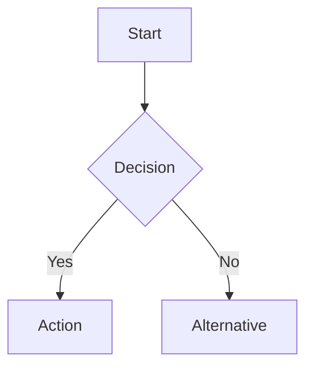
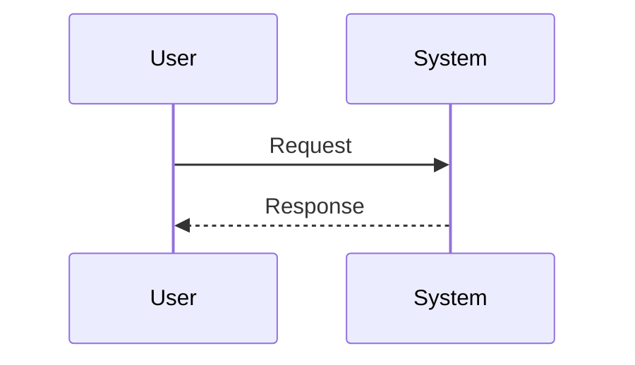

# Quickstart: MkDocs Documentation Development

**Feature**: 001-mkdocs-documentation
**Date**: 2026-01-20

---

## Prerequisites

- Python 3.11+
- pip
- Git

## Local Setup

### 1. Create Python Virtual Environment

```bash
cd /Users/seaton/Documents/src/madeinoz-recordmanager-skill
python3 -m venv .venv
source .venv/bin/activate
```

### 2. Install Dependencies

```bash
pip install mkdocs-material mkdocs-minify-plugin mkdocs-git-revision-date-localized-plugin
```

Or with requirements file:
```bash
pip install -r requirements-docs.txt
```

### 3. Start Local Server

```bash
mkdocs serve
```

Documentation will be available at: http://127.0.0.1:8000

### 4. Live Editing

Edit any file in `docs/` - the browser will automatically reload with changes.

---

## Creating New Pages

### 1. Create the Markdown File

```bash
# Example: new user guide page
touch docs/user-guide/new-feature.md
```

### 2. Add Content with Header

```markdown
# New Feature

Description of the new feature.

## Usage

How to use it...
```

### 3. Add to Navigation

Edit `mkdocs.yml`:

```yaml
nav:
  - User Guide:
    - user-guide/index.md
    - New Feature: user-guide/new-feature.md  # Add here
```

---

## Adding Mermaid Diagrams

### Flowchart Example

````markdown

````

### Sequence Diagram Example

````markdown

````

---

## Building for Production

### Manual Build

```bash
mkdocs build
```

Output goes to `site/` directory.

### Deploy to GitHub Pages

Automatic on push to `main` branch via GitHub Actions.

Manual deploy:
```bash
mkdocs gh-deploy --force
```

---

## Common Tasks

| Task | Command |
|------|---------|
| Start dev server | `mkdocs serve` |
| Build site | `mkdocs build` |
| Deploy to GH Pages | `mkdocs gh-deploy --force` |
| Check for errors | `mkdocs build --strict` |

---

## File Structure Reference

```
.
├── mkdocs.yml              # Main configuration
├── docs/
│   ├── index.md            # Homepage
│   ├── assets/             # Images, favicon
│   ├── stylesheets/        # Custom CSS
│   └── [sections]/         # Documentation sections
├── site/                   # Built output (gitignored)
└── requirements-docs.txt   # Python dependencies
```

---

## Troubleshooting

### Port Already in Use

```bash
mkdocs serve -a localhost:8001
```

### Clear Cache

```bash
rm -rf site/
mkdocs build --clean
```

### Check Build Errors

```bash
mkdocs build --strict 2>&1 | head -50
```
