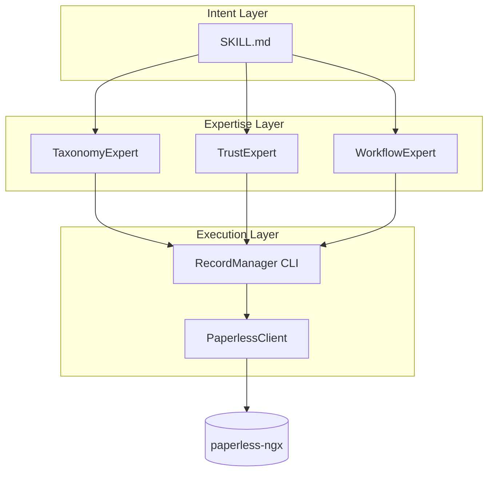
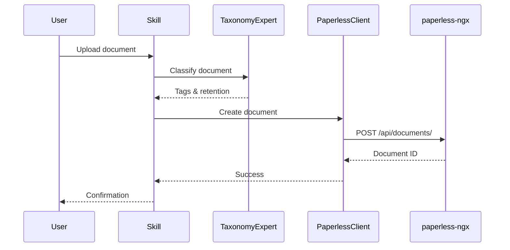
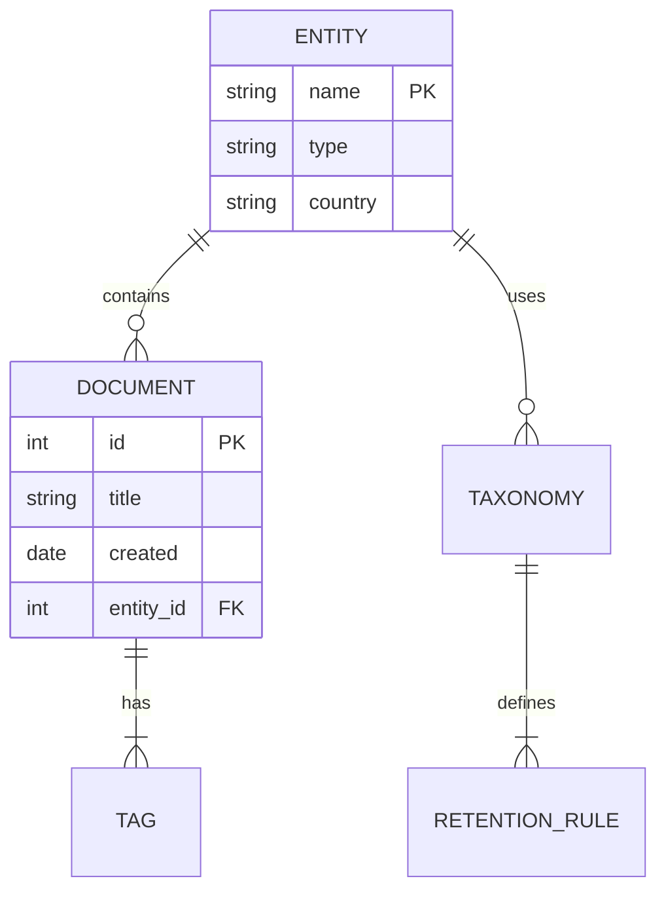

# Research: MkDocs Material Documentation Site

**Feature**: 001-mkdocs-documentation
**Date**: 2026-01-20
**Status**: Complete

---

## 1. MkDocs Material Configuration Best Practices

### Decision
Use a modular, well-organized mkdocs.yml with schema validation, custom PAI colors via CSS variables, and 3-level navigation hierarchy.

### Rationale
- Material for MkDocs provides its own schema.json for editor validation
- CSS variables allow precise brand customization with hex colors
- Combination of tabs + sections + index pages provides intuitive 3-level navigation

### Alternatives Considered
- **Predefined color schemes**: Rejected - PAI colors (#4a90d9, #8b5cf6) not available as presets
- **Flat navigation**: Rejected - 20+ pages require hierarchy for usability
- **Custom theme**: Rejected - Material theme is sufficient with CSS customization

### Configuration

```yaml
# yaml-language-server: $schema=https://squidfunk.github.io/mkdocs-material/schema.json

site_name: Records Manager Skill
site_url: https://madeinoz67.github.io/madeinoz-recordmanager-skill/
site_description: Expert record keeping with paperless-ngx integration

repo_url: https://github.com/madeinoz67/madeinoz-recordmanager-skill
repo_name: madeinoz67/madeinoz-recordmanager-skill
edit_uri: edit/main/docs/

theme:
  name: material
  logo: assets/icon.png
  favicon: assets/favicon.png
  palette:
    - media: "(prefers-color-scheme: light)"
      scheme: default
      primary: custom
      accent: custom
      toggle:
        icon: material/brightness-7
        name: Switch to dark mode
    - media: "(prefers-color-scheme: dark)"
      scheme: slate
      primary: custom
      accent: custom
      toggle:
        icon: material/brightness-4
        name: Switch to light mode
  features:
    - navigation.tabs
    - navigation.tabs.sticky
    - navigation.sections
    - navigation.indexes
    - navigation.path
    - navigation.top
    - navigation.footer
    - navigation.instant
    - navigation.instant.progress
    - search.suggest
    - search.highlight
    - content.code.copy
```

### Custom Colors (docs/stylesheets/extra.css)

```css
:root,
[data-md-color-scheme="default"] {
  --md-primary-fg-color:        #4a90d9;
  --md-primary-fg-color--light: #7ab0e6;
  --md-primary-fg-color--dark:  #3570b0;
  --md-accent-fg-color:         #8b5cf6;
  --md-accent-fg-color--transparent: rgba(139, 92, 246, 0.1);
}

[data-md-color-scheme="slate"] {
  --md-primary-fg-color:        #5a9fe8;
  --md-primary-fg-color--light: #8bbff0;
  --md-primary-fg-color--dark:  #4a90d9;
  --md-accent-fg-color:         #a78bfa;
  --md-accent-fg-color--transparent: rgba(167, 139, 250, 0.1);
  --md-hue: 220;
}
```

---

## 2. GitHub Actions Workflow

### Decision
Use single workflow file at `.github/workflows/docs.yml` with `mkdocs gh-deploy --force`.

### Rationale
- Official recommendation from Material for MkDocs documentation
- Simpler than peaceiris/actions-gh-pages - one command handles build and deploy
- Weekly cache rotation balances freshness with build speed

### Alternatives Considered
- **peaceiris/actions-gh-pages**: Rejected - adds complexity without benefit for single-site deployment
- **Manual build + push**: Rejected - mkdocs gh-deploy handles this automatically

### Workflow Configuration

```yaml
name: docs
on:
  push:
    branches:
      - main
permissions:
  contents: write
jobs:
  deploy:
    runs-on: ubuntu-latest
    steps:
      - uses: actions/checkout@v4
      - name: Configure Git Credentials
        run: |
          git config user.name github-actions[bot]
          git config user.email 41898282+github-actions[bot]@users.noreply.github.com
      - uses: actions/setup-python@v5
        with:
          python-version: 3.x
      - run: echo "cache_id=$(date --utc '+%V')" >> $GITHUB_ENV
      - uses: actions/cache@v4
        with:
          key: mkdocs-material-${{ env.cache_id }}
          path: ~/.cache
          restore-keys: |
            mkdocs-material-
      - run: pip install mkdocs-material mkdocs-minify-plugin mkdocs-git-revision-date-localized-plugin
      - run: mkdocs gh-deploy --force
```

### Badge Markdown

```markdown
[](https://github.com/madeinoz67/madeinoz-recordmanager-skill/actions/workflows/docs.yml)
```

---

## 3. Mermaid Diagram Integration

### Decision
Use native Material for MkDocs integration via pymdownx.superfences custom fence.

### Rationale
- Built-in support handles font/color theming automatically
- No additional plugins required
- Full support for flowchart, sequence, class, ER diagrams

### Alternatives Considered
- **mkdocs-mermaid2 plugin**: Rejected - adds complexity; native support is sufficient
- **External diagram images**: Rejected - loses version control and editability benefits

### Configuration

```yaml
markdown_extensions:
  - pymdownx.superfences:
      custom_fences:
        - name: mermaid
          class: mermaid
          format: !!python/name:pymdownx.superfences.fence_code_format
```

### Supported Diagram Types

| Type | Declaration | Use Case |
|------|-------------|----------|
| Flowchart | `flowchart TD` | Workflows, processes |
| Sequence | `sequenceDiagram` | Actor interactions |
| Class | `classDiagram` | OOP structures |
| ER | `erDiagram` | Database modeling |
| State | `stateDiagram-v2` | State machines |

### Example Diagrams

**System Architecture (Flowchart)**


**Upload Workflow (Sequence)**


**Entity Relationships (ER)**


---

## 4. Plugin Selection

### Decision
Use minimal plugin set: search (built-in), minify, git-revision-date-localized.

### Rationale
- Search is built-in and privacy-compliant (client-side)
- git-revision-date-localized shows "last updated" per page
- minify reduces HTML size for faster loads
- Avoid plugin bloat that impacts build performance

### Alternatives Considered
- **optimize plugin**: Deferred - no large images in docs initially
- **social cards**: Deferred - nice-to-have for later
- **offline plugin**: Rejected - not needed for this project

### Plugin Configuration

```yaml
plugins:
  - search:
      lang: en
      separator: '[\s\-,:!=\[\]()\"/]+|(?!\b)(?=[A-Z][a-z])'
  - minify:
      minify_html: true
      minify_js: true
      minify_css: true
  - git-revision-date-localized:
      enable_creation_date: true
      type: timeago
      fallback_to_build_date: true
```

### Requirements (requirements-docs.txt)

```
mkdocs-material>=9.5
mkdocs-minify-plugin>=0.8.0
mkdocs-git-revision-date-localized-plugin>=1.3.0
```

---

## 5. Navigation Structure

### Decision
3-level hierarchy using tabs (L1), sections (L2), and pages (L3) with section index pages.

### Rationale
- Spec requires 3-level depth (Section > Subsection > Page)
- Index pages allow overview content attached to sections
- Sticky tabs keep top-level navigation visible

### Navigation Configuration

```yaml
nav:
  - Home: index.md
  - Getting Started:
    - getting-started/index.md
    - Installation: getting-started/installation.md
    - Prerequisites: getting-started/prerequisites.md
    - Quick Start: getting-started/quick-start.md
  - User Guide:
    - user-guide/index.md
    - Uploading: user-guide/uploading.md
    - Searching: user-guide/searching.md
    - Tagging: user-guide/tagging.md
    - Retention: user-guide/retention.md
    - Trusts: user-guide/trusts.md
    - Workflows: user-guide/workflows.md
  - Reference:
    - reference/index.md
    - CLI: reference/cli.md
    - Agents: reference/agents.md
    - Environment: reference/environment.md
    - API: reference/api.md
  - Extending:
    - extending/index.md
    - Taxonomies: extending/taxonomies.md
    - New Entity Types: extending/new-entity-types.md
    - Custom Taxonomies: extending/custom-taxonomies.md
    - Examples: extending/examples.md
  - Examples:
    - examples/index.md
    - Prompts: examples/prompts.md
  - Architecture:
    - architecture/index.md
    - Overview: architecture/overview.md
  - Changelog: changelog.md
  - Troubleshooting: troubleshooting.md
```

---

## Sources

- [Material for MkDocs - Setup](https://squidfunk.github.io/mkdocs-material/setup/)
- [Material for MkDocs - Publishing Your Site](https://squidfunk.github.io/mkdocs-material/publishing-your-site/)
- [Material for MkDocs - Changing the Colors](https://squidfunk.github.io/mkdocs-material/setup/changing-the-colors/)
- [Material for MkDocs - Setting up Navigation](https://squidfunk.github.io/mkdocs-material/setup/setting-up-navigation/)
- [Material for MkDocs - Diagrams](https://squidfunk.github.io/mkdocs-material/reference/diagrams/)
- [PyMdown Extensions - Mermaid](https://facelessuser.github.io/pymdown-extensions/extras/mermaid/)
- [Mermaid - Flowchart Syntax](https://mermaid.js.org/syntax/flowchart.html)
- [Mermaid - Sequence Diagrams](https://mermaid.ai/open-source/syntax/sequenceDiagram.html)
- [Mermaid - ER Diagrams](https://mermaid.ai/open-source/syntax/entityRelationshipDiagram.html)
- [GitHub Docs - Adding a Workflow Status Badge](https://docs.github.com/actions/managing-workflow-runs/adding-a-workflow-status-badge)
- [mkdocs-git-revision-date-localized-plugin](https://github.com/timvink/mkdocs-git-revision-date-localized-plugin)
